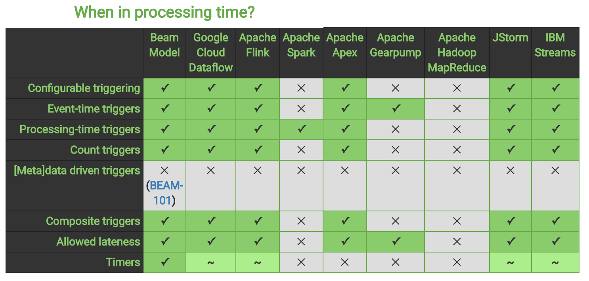

# 4. Apache Beams Vielfalt

Durch das What, Where, When und How kann Apache Beam vielseitig eingesetzt werden. In dieser Arbeit wurde bisher folgendes kennen gelernt:  
* klassische Batchprocessing (What)
* Batchprocessing mit festen Window-Größen (What+Where)
* Verarbeitung von Streaming  (What+Where+When)
* Verarbeitung von Stream mit Berücksichtigung von späten Ereignissen  (What+Where+When)
* Streaming with Retractions (What+Where+When+How)

Apache Beam unterstützt ebenfalls Sessions und wirbt damit, wie leicht Code angepasst werden kann, um andere Resultate zu erhalten. Zum Beispiel analysiert man, durch das Ändern einer Zeile Code, die Daten nicht mehr mittels statischen Zeitfenster, sondern mittels Sessions.      

```Java
PCCollection<KV<String, Integer>> scores = input.apply(Window.into(Sessions.withGapDuration(Minutes(1)).triggering(AtWatermark().withEarlyFirings(AtPeriod(Minutes(1)).withLateFirings(AtCount(1)).accumulatingAndRetractingFiredPanes()).apply(Sum.integersPerKey());
```

Um zu messen wie lange die Sessions sind, bietet Apache Beam ebenfalls eine Lösung an.
```Java
input.apply(Window.into(Sessions.withGapDuration(Minutes(1))).trigger(AtWatermark()).discardFiredPanes()).apply(CalculateWindowLength())
```

Daneben kann weiterer Code angehangen werden, um die durchschnittliche Sessionszeit aus allen Benutzern zu erhalten:
```Java
apply(Window.into(FixedWindows.of(Minutes(2))).trigger(AtWatermark()).withEarlyFirings(AtPeriod(Minutes(1))).accumulatingFiredPanes()).apply(Mean.globally())
```

Dies kann z.B. hilfreich sein, wenn man neue Versionen ausrollt und Unterschiede zu der vorherigen feststellen möchte. Im weiteren findet sich eine von Apache Beam herausgegebene Übersicht zu anderen Produkten in Bezug auf What, Where, When und How.


## What
Die Abbildung 10 zeigt links Eigenschaften von What und rechts bisherige Produkte.

Interessant festzustellen ist, dass das Beam Model alle Eigenschaft abdeckt oder immerhin tangiert wie bei Splittable DoFn und Metrics. Stateful Processing erfüllt nur das Beam Model vollständig. Im Detail bedeutet Stateful Processing, dass ein Zugriff auf einen persistieren Status per Key oder per Window durchgeführt werden kann. Dies ist dann praktisch, wenn Combine oder GroupByKey+ParDo nicht effizient eingesetzt werden können.     

Es ist zwischen den Runnern zu unterscheiden, während z.B. Google Cloud Dataflow, JStorm oder Apache Hadoop MapReduce ähnlich mächtig mit dem Beam Model arbeiten können, bieten Apache Spark, Apache Apex und Apache Gearpump deutlich weniger Möglichkeiten.  


Abbildung 10: What im Vergleich [**[Beam18c]**](10_Literaturverzeichnis.md)


## Where
Diese Grafik zeigt, dass alle aufgeführten Runner über dieselben Windowing Verfahren verfügen.


Abbildung 11: Where im Vergleich [**[Beam18c]**](10_Literaturverzeichnis.md)


## When
Beim Triggering bietet das Apache Beam Model Funktionalitäten, die noch nicht von den Runnern genutzt werden können. Das Beam Model unterstüzt z.B. bereits [Meta]data driven triggers, also die Möglichkeit zu erfassen, wenn Attribute aus Daten fertig verarbeitet worden sind.
Google Cloud Dataflow, Apache Flink, JStorm und IBM Streams erlauben Timer in non-mergingen Windows, das Beam Model bietet zusätzlich an, dass Timer anhand der Process- oder Event Time einstellt werden können.


Abbildung 12: When im Vergleich [**[Beam18c]**](10_Literaturverzeichnis.md)


## How
Bei den Behandlungsmethoden unterstützen die meisten Runner Discarding und Accumulating. Bei dem Apache Beam Model befindet sich Accumulating & Retracting in der Implementierung, scheint allerdings noch in keiner Release-Version zur Verfügung zu stehen. In Vorführungen wird diese Technologie bereits beworben.


Abbildung 13: How im Vergleich [**[Beam18c]**](10_Literaturverzeichnis.md)

Aus den Abbildungen ist zu erkennen, dass das Beam Model vielseitig die Funktionalitäten für die Runner bereitstellt und zusätzlich mit noch weiteren Features hervorsticht, die derzeit noch nicht von den Runnern umgesetzt werden können.

---------

[☜ vorheriges Kapitel](3_Beam_Model.md)
   |   [nächstes Kapitel ☞](5_Apache_Beam_Model_SDKs_und_Runner.md)
