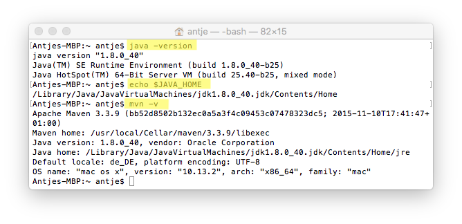

# 6. Implementierung MinimalWordCount

Das Beispiel MinimalWordCount ist vom Apache Beam Team entworfen und unter https://github.com/apache/beam/tree/master/examples/java zu finden. Es ist ein Java Beispiel, dass die Anzahl eines Wortes aus einer Textdatei (Input) einliest und das Wort mit der Anzahl in eine neue Textdatei schreibt (Output).

## Voraussetzungen für Entwicklungsumgebung

Die Voraussetzungen in der Entwicklungsumgebung sind: 
- Java 1.7 oder neuer
- Umgebungsvariable *$JAVA_HOME* gesetzt
- [Apache Maven](https://maven.apache.org/) 

In der Abbildung 14 ist die Konsolen-Ausgabe zur Überprüfung der Voraussetzungen zu sehen. Die markierten Stellen zeigen die Befehle, die im Mac-Terminal eingegeben werden können. 

<br>Abbildung 14: Voraussetzungen der Entwicklungsumgebung auf einem Mac geprüft

## Apache Maven

Apache Beam arbeitet eng mit dem Apache Maven Tool zusammen. Maven verwendet eine Konfigurationsdatei im XML Format. In dieser project-object-model-Datei (pom.xml) werden Abhängigkeiten zum Projekt beschreiben und mit diesen Informationen kann Apache Maven dann z.B. Java-Projekt kompilieren oder die Unit-Tests durchlaufen. In der Konsole wird Maven mit mvn abgekürzt. Der Aufbau eines CLI-Befehls ist: 
> mvn [options] [<goal(s)>] [<phase(s)>]
 (https://maven.apache.org/run.html)

## Einbinden des SDKs
Mit Apache Maven kann man eine Java-Projekt-Struktur erstellen. Der Befehle 

```
$ mvn archetype:generate -DgroupId=de.hsEmdenLeer.app -DartifactId=minimalWordCount -DarchetypeArtifactId=maven-archetype-quickstart -DinteractiveMode=false
```

erstellt ein Hello-World Projekt mit pom.xml Datei. In die pom.xml kann nun die Abhängigkeit zu Apache Beam angegeben werden: 

```xml
<dependency>
  <groupId>org.apache.beam</groupId>
  <artifactId>beam-sdks-java-core</artifactId>
  <version>2.2.0</version>
</dependency>
<dependency>
  <groupId>org.apache.beam</groupId>
  <artifactId>beam-runners-direct-java</artifactId>
  <version>2.2.0</version>
  <scope>runtime</scope>
</dependency>
```

Mit dem Befehl

```
$ mvn package
```

werden alle angegebenen Packages heruntergeladen und installiert. Der nächste Schritt ist es, das Java-SDK zu verwenden.

## Java-Klasse und Pipeline implementieren

An dem Beispiel MinimalWordCount wird der Aufbau einer Beam-Pipeline gezeigt. 

### Vorschau der fertigen Klasse:
```Java
package de.hsEmdenLeer.app;

import de.hsEmdenLeer.app.common.ExampleUtils;
import de.hsEmdenLeer.app.sdk.Pipeline;
[...]

public class MinimalWordCount {

  public static void main(String[] args) {
    PipelineOptions options = PipelineOptionsFactory.create();
    Pipeline p = Pipeline.create(options);

    p.apply(TextIO.read().from("gs://apache-beam-samples/shakespeare/*"))
        .apply(Count.<String>perElement())
        .apply("FormatResults", MapElements.via(new SimpleFunction<KV<String, Long>, String>() {
          @Override
          public String apply(KV<String, Long> input) {
            return input.getKey() + ": " + input.getValue();
          }
        }))
        .apply(TextIO.write().to("wordcounts"));
    p.run().waitUntilFinish();
  }
}
```
### Aufbau der Java-Klasse
In der ersten Zeile der Class-Datei wird das Package angegeben, indem sich die Datei befinden. Dann folgen die Importe aus dem SDK und weiteren Klassen, die verwendet werden. 

Die MinimalWordCount.class ist unser Hauptklasse und beinhaltet deshalb die Main-Methode. Diese wird beim Aufruf der Anwendung als erstes aufgerufen. 

Es wird eine Beam-Pipeline mit den Standard-Optionen erstellt:

```Java
PipelineOptions options = PipelineOptionsFactory.create();
Pipeline p = Pipeline.create(options);
```
Die Pipeline-Optionen könnten beispielsweise auch durch einen spezifischen Runner erweitert werden. Wird nichts angegeben wir der DirectRunner verwendet. 

### Pipeline transformieren und ausführen
Die Pipeline *p* kann nun mit Funktionen erweitert (*apply*) und ausgeführt (*run*) werden. 

Die Funktionen werden in der Reihenfolge abgearbeitet, in der sie angegeben sind. Das erste *apply* bzw. die erste Transformation fügt einen Text-Input-Stream hinzu, der den Shakespear-Text Zeile für Zeile in einer PCollection zurückgibt.

```Java
p.apply(TextIO.read().from("gs://apache-beam-samples/shakespeare/*"))
```

Die nächste Transformation ist ein ParDo transform. Dies verarbeitet die PCollection, bestehend aus Textzeilen, zu individuellen Wörtern in einer weiteren PCollection\<String>.

```Java
.apply("ExtractWords", ParDo.of(new DoFn<String, String>() {
  @ProcessElement
  public void processElement(ProcessContext c) {
    for (String word : c.element().split(ExampleUtils.TOKENIZER_PATTERN)) {
      if (!word.isEmpty()) {
        c.output(word);
      }
    }
  }
}))
```

Mit dem nächten *apply* werden die Wörter aus der PCollection\<String> pro vorkommendem Element gezählt. Dafür wird die Count-Transformation von Apache Beam verwendet. Die neue PCollection besteht aus der Wortanzahl(Value) und dem Wort(Key).

```Java
.apply(Count.<String>perElement())
```

Für die Ausgabe der PCollection wird die MapElements-Funktion zur Hilfe genommen. So kann die Collection in ein menschlich leserliches Format gebracht werden. 

```Java
.apply("FormatResults", MapElements.via(
  new SimpleFunction<KV<String, Long>, String>() {
      @Override
      public String apply(KV<String, Long> input) {
        return input.getKey() + ": " + input.getValue();
      }
    }
  )
)
```

Abschließend wird von der Pipeline mit einem Text-Output-Stream transformierte leserliche PCollection in eine Datei mit der Bezeichnung "wordcounts" geschrieben. Für jede eingelesene Shakespeare-Datei wird eine Nummer angehängt, sodass die Dateien später "wordcount-00001-of-00005" heißen. 

```Java
.apply(TextIO.write().to("wordcounts"));
```

Die Pipeline wird mit dem *run* ausgeführt, wobei hier weitere Optionen angegeben werden können. Mit dem Methodenaufruf .waitUntilFinish() wird gewartet bis die Pipeline durchlaufen ist und der Status dann zurückgegeben. 

```Java
p.run().waitUntilFinish();
```

### Runner starten

Mit dem Befehl 
```
$ mvn compile exec:java         -Dexec.mainClass=de.hsEmdenLeer.app.MinimalWordCount \
     -Dexec.args="--inputFile=pom.xml --output=wordcounts" -Pdirect-runner
```
wird der DirectRunner mithilfe von Maven gestartet und das Java-Beam-Projekt kompiliert und ausgeführt. Dadurch entstehen die Wordcount-Dateien mit dem Ergebnis (vgl. Abbildung 15)

### Erwartetes Ergebnis
Nimmt man das Beam-GitHub-Beispiel und kompiliert es und führt den DirectRunner aus entsteht folgendes Ergebnis: 
<br>Abbildung 15a: Ergebnisse des MinimalWordCount mit Shakespear-Beispiel in Konsole
<br>Abbildung 15b: Ergebnisse des MinimalWordCount mit Shakespear-Beispiel in Textdatei

### Eigentliches Ergebnis
Die Verknüpfungen zu dem SDK stimmen nicht und beim kompilieren wird Diamond-Operator nicht unterstützt. Dies sind nur zwei von vielen Fehlern, die während des Reproduzierens des Beispiels aufgetreten sind. Ist das Beispiel in dem Beam-GitHub-Examples-Ordner lässt es sich installieren und kompilieren. Sobald ein neues Java-Projekt mit Maven-Datei angelegt werden fehlen Angaben und Verknüpfungen und es kann nicht mehr kompiliert werden. Das Ergebnis ist in Abbildung 16 dargestellt. Nach mehreren Stunden des Probierens ist nicht mehr herausgekommen. Das aktuelle Ergebnis ist [hier](minimalWordCount/) zu finden. 

<br>Abbildung 16: Eigentliches Ergebnisse des neuen MinimalWordCount mit Shakespear-Beispiel

---------

[☜ vorheriges Kapitel](5_Apache_Beam_Model_SDKs_und_Runner.md)
   |   [nächstes Kapitel ☞](7_Beam_Vision.md)


