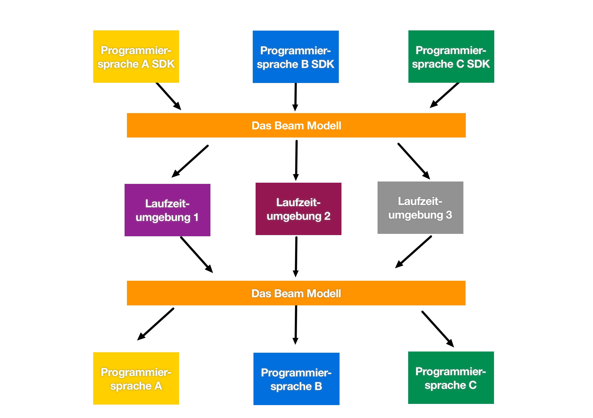

# 7. Beam Vision

Das Apache Beam Team hat es sich zur Aufgabe gemacht unterschiedliche SDKs und Laufzeitumgebungen beliebig mit Apache Beam kombinieren zu können. 
Das Herzstück von Apache Beam bildet das Beam Model. Es ist in einem SDK mit einer bestimmten Programmiersprache umgesetzt und kann auf unterschiedliche Laufzeitumgebungen (Runners) ausgespielt werden.
Der Output kann dann wieder mit der gewählten Programmiersprache bearbeitet werden. Abbildung 17 beschreibt dieses Prinzip.

Abbildung 17: Die Beam Vision als Model

In Abbildung 18 sind die aktuell verfügbaren SDKs aufgeführt. In der Mitte der Abbildung sind Laufzeitumgebungen dargestellt, für die es die kompatiblen Runner gibt. 

Abbildung 18: Die Beam Vision mit konkreten aktuellen Elementen

Die Vision von Apache Beam beinhaltet viele SDKs und Runner. So ist es den Nutzern möglich, in ihrer vertrauten Programmiersprache zu arbeiten und die Runner beliebig zu wechseln. Die Laufzeitumgebung kann einfach angepasst werden, ob nun eine Cloud-basierte Lösung oder eine Open Source Lösung gefordert ist, ist egal. Auch die Skalierbarkeit ist eine Forderung in der Beam Vision. Eine klare API soll es den Entwicklern erlauben die verwendeten Module unabhängig voneinander zu erweitern.

---------

[☜ vorheriges Kapitel](6_Implementierung_Minimal_Word_Count.md)
   |   [nächstes Kapitel ☞](8_Evolution_von_Apache_Beam.md)
