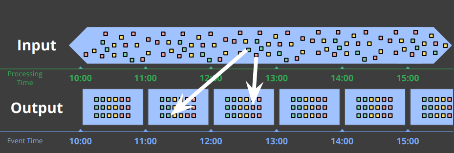

# 2. Datastreams

Jede gut programmierte Software, sei es ein Spiel oder eine komplexe Business Application, produziert eine Masse an Daten, unter anderem Nutzerspezifische Daten wie Feedback oder Fehlerprotokolle und den Entwicklern zu helfen Fehler in der Software präziser zu lokalisieren und diese entsprechend zeitlich zu beheben.

Zu Beginn einer Software halten diese Daten sich im Rahmen und sind in geringer Zahl vorhanden und es kann ein Überblick über die vorhandenen Daten gewährleistet werden. Mit zunehmender Popularität bzw. steigender Nutzerzahl der Software wächst auch die Anzahl der produzierten Daten. Dies kann je nach produzierten Datenmengen auch zu einem unendlichen Datenstrom werden. Hinzukommt das die erzeugten Daten nicht mit den tatsächlichen Zeiteinheiten übereinstimmen müssen und da in verteilten System es zu Verzögerungen beim Verarbeiten der Daten kommen kann.

Der erste Schritt um diese Daten zu sinnvoll managen zu könne, ist es diese zu strukturieren, indem beispielsweise diese in Gruppierung von Zeiteinheite zu unterteilen. (Montag - Sonntag + die jeweilige Uhrzeit mit dazu)

In verteilten Systemen ist es schwierig die entsprechenden Daten Punktgenau zu verwalten, da nicht gewährleistet kann die Daten Chronologisch wie sie erzeugt werden auch auf das System geschrieben werden. Es gibt ein Unterschied zwischen der Processing Time und der Event Time, das heißt wann die Daten wirklich erstellt wurden und wann Sie entsprechend verarbeitet werden.

Daten im Processing Time sind ungeordnet und müssen den entsprechenden Zeiten wo sie wirklich auf getreten sind richtig zugeordnet werden.

Element-wise transformations werden auf einzelne Elemente ausgeführt. Darunter zählen zum Beispiel Parsen und Filtern der Datensätze.

Um Daten aus der Processing Time der entsprechenden Event Time zuzuordnen gibt es mehrere Möglichkeiten. Es können auch zusammenhängende Datensätze in separate Chunk Blöcke mittels Processing-Time Windows zugeordnet werden. Immer wenn ein Neuer Datensatz entsteht wird er in das entsprechende Zeitfenster eingeordnet. Dies kann aber dazu führen das es zu Daten Missständen kommt da die Processing Time und die Event Time nicht gleich sein kann. Das heißt es müssen die zusammengehörigen Daten nicht von der Processing Time abhängig in Blöcke geteilt werden, sondern in die Blöcke der Event Time. Dies hat zur Folge das der Kontext über die Datensätze hinweg erhalten werden kann.

------------

[vorheriges Kapitel](1_Einleitung.md) | [nächstes Kapitel](3_Processing_Time_und_Event_Time.md)
