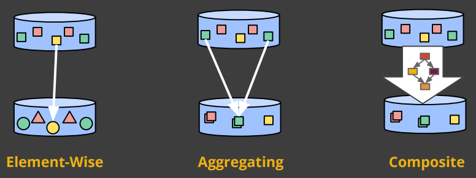
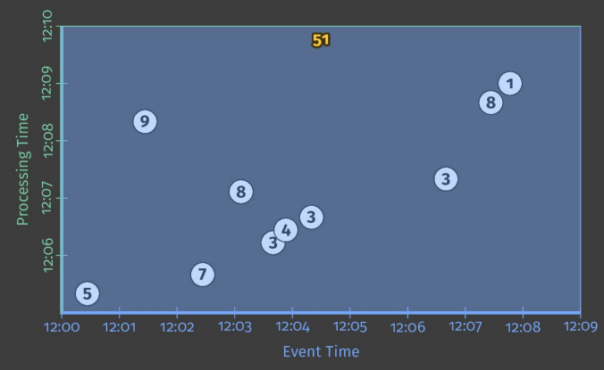
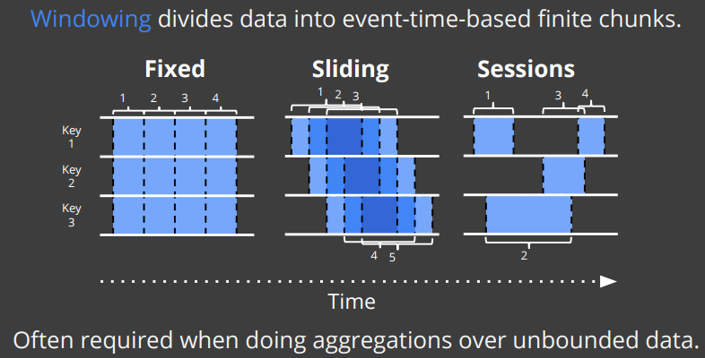
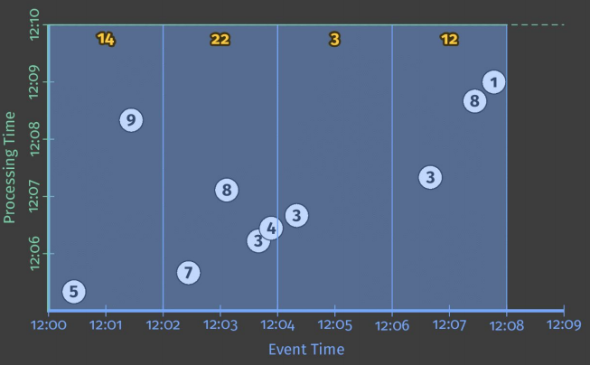
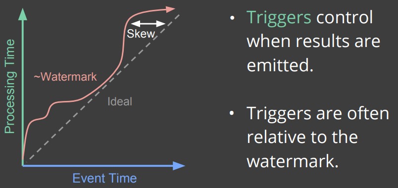
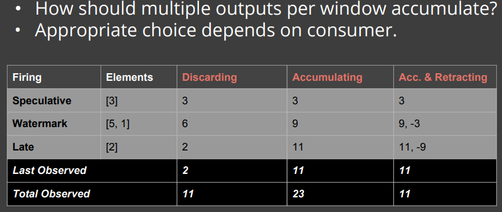
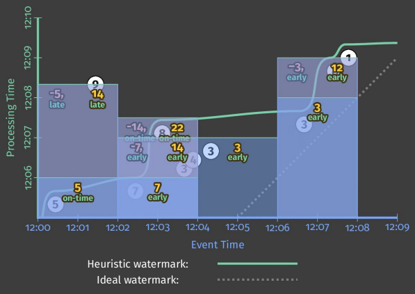

# 4. What, Where, When and How

##What are you computing?

Welche Transformation an Daten hat man in seinem System - Zahlen zusammen Addieren, Highscores berechnen, Diagramme berechnen. Dies entspricht dem klassischen Batchprozessing.



Bei Element-Wise wird auf ein einziges Element geschaut und isoliert dies von dem Rest der Datenmenge. Dieses Verfahren ist leicht parallel zu betreiben, da man es über mehrere Maschinen gleichzeitig anwenden kann. 

Aggregating wird bei sämtlich Datenmengen benutzt die man im Verbund zueinander sieht. Wenn nicht nur ein Element sondern mehrere Elemente die in Verbindung stehen, zusammengefassen werden.

Als letztes wäre dann noch die Composite, in der nicht auf Details achtet wie bei den Aggregationen sondern noch einen Schritt weiter geht und diese Aggregationen in größere Zusammenhänge in einer Komposition betrachtet und verarbeiten möchte.

Beispiel für das Berechnen Ganzzahliger Summen:

```Java
//Collection of raw log lines
PCollection<String> raw = IO.read(...);
// Element-wise transformation into team/score pairs
PCollection<KV>String, Integer>> input = raw.apply(ParDo.of(new ParseFn());
// Composite transformation containing an aggregation
PCollection<KV>String, Integer>> scores = input.apply(Sum.integersPerKey());
```



##Where in event time?

Wo sind meine Daten in der Event Time - Benutzt man Aggregated Window, Sliding Windows oder Session Windows.



###Fixed

Bei der Variante Fixed wird Zeitfenster mit bestimmten gleichmäßigen abstand erzeugt und alle Daten werden je nach Zeitstempel in die entsprechenden Fenster eingeteilt.

###Sliding

Beim Sliding spielt die Überlappung der Fenster einer große Rolle da hier Element auch mehrfach in der Auswertung vorkommen können und somit die Ergebnisse anders beeinflussen können. Das beste Beispiel hierfür wäre, wenn in jeder Stunde Elemente aus den letzten 24 Stunden ausgewertet werden.

###Sessions

Sind sehr flexibel was den Einsatz angeht, aber gleichzeitig auch sehr komplex. Hier muss genau abgepasst werden wie die Daten ausgewertet werden, da jeder Nutzer in einer Session andere Verhaltensmuster hat und um diese entsprechend Filtern zu können muss die Auswertung gut abgestimmt sein, um nicht falsche Ergebnisse zu erzielen.

```Java
//Collection of raw log lines
PCollection<String> raw = IO.read(...);
// Element-wise transformation into team/score pairs
PCollection<KV>String, Integer>> input = raw.apply(ParDo.of(new ParseFn());
// Composite transformation containing an aggregation
PCollection<KV>String, Integer>> scores = input.apply(Window.into(FixedWindows.of(Minutes(2))).apply(Sum.integersPerKey());
```



##When in processing time?

Wann sind die Daten in der Processing Time und ab wann werden diese Daten wichtig und ab wann unwichtig. Sind später eintreffende Daten noch sinnvoll zum auswerten oder sollen diese ignoriert werden.



Trigger sind ein nützliches Werkzeug um herauszufinden wann Elemente in der Pipeline sind und gesendet werden. Triggers sind meist relativ zur Watermark. Zusätzlich kann man auch noch Einschränkungen treffen um zu frühe oder zu späte Elemente mit in die Auswertung nehmen welche sich außerhalb der Watermark befinden können, aber dennoch berechtigt sind ausgewertet zu werden.

```Java
//Collection of raw log lines
PCollection<String> raw = IO.read(...);
// Element-wise transformation into team/score pairs
PCollection<KV>String, Integer>> input = raw.apply(ParDo.of(new ParseFn());
// Composite transformation containing an aggregation
PCollection<KV>String, Integer>> scores = input.apply(Window.into(FixedWindows.of(Minutes(2)).triggering(AtWatermark().withEarlyFirings(AtPeriod(Minutes(1))).withLateFirings(AtCount(1)))).apply(Sum.integersPerKey());
```


##How do refinements relate?

Soll die Ergebnisse der Daten auf einander aufbauen oder sollen sie unabhängig voneinander betrachtet werden um sie für die entsprechende Art und Weise auszuwerten.



###Discarding

Beim Discaring Modus werden nur die Elemente aufgenommen die seit dem letzten Firing Process aufgenommen wurden. In dem oberen abgebildeten Beispiel werden zuerst das Element 3 ausgewertet, anschließend die Elemente 5 und 1 separat und zum Schluß das einzelne Element 2. Diese verdeutlicht auch nochmal die letzten beiden Zeilen, wo die Elemente aufgezählt werden wie viele insgesamt betrachtet wurden und wie viele Elemente zuletzt betrachtet wurden.

###Accumulating

Der Accumulaing Modus summiert die einzelnen Elemente bei jedem Firing Prozess zusammen, was zur Folge hat das die Zahl im Last Observed der Zahl 11 entspricht aber die Gesamtanzahl der betrachteten Elemente bei 23 liegt-

###Accumulating & Retracting

Dieser Modus ist angelehnt an den vorherigen Modus nur das hier die vorherigen betrachteten Element wieder von den aktuellen abgezogen werden. Somit sind beide Zahlen vom letzten und der Gesamtbetrachtung her identisch und liegen bei 11.

```Java
//Collection of raw log lines
PCollection<String> raw = IO.read(...);
// Element-wise transformation into team/score pairs
PCollection<KV>String, Integer>> input = raw.apply(ParDo.of(new ParseFn());
// Composite transformation containing an aggregation
PCollection<KV>String, Integer>> scores = input.apply(Window.into(FixedWindows.of(Minutes(2)).triggering(AtWatermark().withEarlyFirings(AtPeriod(Minutes(1))).withLateFirings(AtCount(1))).accumulatingAndRetractingFiredPanes()).apply(Sum.integersPerKey());
```



---------

[vorheriges Kapitel](3_Processing_Time_und_Event_Time.md) | [nächstes Kapitel](5_Fazit.md)
