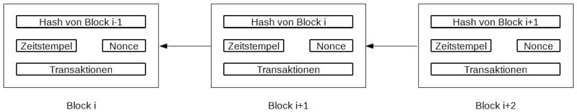

[<< zurück](02_toc.md)

***

# Grundlagen

Eine Blockchain ist eine Kette von Blöcken, die über eine kryptographische Hashfunktion miteinander verbunden sind. Der über die Hashfunktion erzeugte Hashwert kann dabei als Zeiger auf den vorangehenden Block verstanden werden. Neu anzuhängende Blöcke müssen stets den Hashwert des Blockes enthalten, an den sie angehängt werden sollen. Das Grundprinzip einer Blockchain entspricht somit einer verketteten Liste, allerdings ist diese mit kryptographischen Mitteln abgesichert. [01]

Verdeutlichen lässt sich das Funktionsprinzip einer Blockchain an einem einfachen Beispiel: Die Besitzverhältnisse zu einem Gegenstand sollen abgebildet werden. Zunächst geht der Gegenstand vom Hersteller in den Besitz eines Händlers über. Diese Transaktion wird in Form eines Blocks gespeichert. Verkauft der Händler den Gegenstand nun an einen Kunden, wird ein neuer Block angehängt, der den erneuten Übergang des Gegenstands vom Händler an den Kunden abbildet. Diese Transaktionskette könnte bei einem späteren Weiterverkauf erweiter werden. Im Nachhinein kann so jederzeit nachvollzogen werden, zu welchem Zeitpunkt welche Transaktion durchgeführt wurde. [01]

## Aufbau einer Blockchain



Die vorstehende Grafik zeigt den typischen Aufbau einer Blockchain. Das elementare Element, über das die namensgebende Kette ("chain") hergestellt wird, ist der Hashwert des vorhergehenden Blockes. Darüber hinaus enthält ein Block typischerweise einen Zeitstempel und eine sogenannte Nonce ("number used once"). Die Nonce ist ein Zahlenwert, der in die Berechnung des Hashwertes einfließt. Schließlich enthält der Block auch noch die eigentliche Transaktion (oder ggf. eine Gruppe von Transaktionen), welche überhaupt erst zur Erzeugung eines neuen Blocks geführt haben. [02]

Eine einmal erzeugte Kette von Blöcken kann nur durch neue Blöcke erweitert werden. Das Ändern oder Löschen bestehender Blöcke ist nicht vorgesehen. Eine Blockchain wird im Laufe ihres Lebens also immer größer.

## Berechnung des Hashwertes

Eine Hashfunktion bildet eine Eingabe von beliebiger Länge auf einen eindeutigen Hashwert mit fester Länge ab. Der Hashwert zeichnet sich dadurch aus, dass er zwar leicht zu errechnen ist, sich aus ihm jedoch nicht (oder nur unter erheblichem Aufwand) die Ausgangsdaten rekonstruieren lassen. Zur Berechnung von Hashwerten kommen deshalb mathematische Einwegfunktionen zum Einsatz. Eine wichtige Eigenschaft von Hashfunktionen ist die sogenannte Kollisionsresistenz. Damit ist gemeint, dass verschiedene Eingabedaten nicht denselben Hashwert hervorbringen dürfen. In der Praxis ist dies allerdings nie mit letzter Konsequenz vermeidbar, da durch die feste Größe des Hashwertes nur eine endliche Menge unterschiedlicher Hashwerte erzeugbar ist, während eine unendliche Menge unterschiedlicher Eingabedaten möglich ist. [03]

## Mining

Bei Blockchains gelten oftmals bestimmte Vorgaben für den Hashwert, so dass ein zusätzliches Datenfeld derart gefüllt werden muss, dass der Hashwert die Vorgaben erfüllt. Dieses zusätzliche Datenfeld ist die oben bereits angesprochene Nonce. Bei Bitcoin muss der Hashwert beispielsweise eine Serie von Nullen aufweisen. Für die Nonce müssen nun verschiedene Werte durchprobiert werden, bis ein Hashwert entsteht, der die Vorgaben erfüllt. Dieses als "Mining" bezeichnete Verfahren ist sehr aufwändig und soll dafür sorgen, dass Blöcke nicht beliebig hinzugefügt werden können.

***

[<< Einleitung](03_introduction.md) | [Anwendungsgebiete >>](05_cryptocurrencies.md)

***

```

Quellenangabe:

[01] - Stephan Wiefling, Luigi Lo Iacono, Frederik Sandbrink: Anwendung der Blockchain außerhalb von Geldwährungen. Erschienen in: Datenschutz und Datensicherheit - DuD, August 2017, Volume 41, Issue 8, S. 482–486.
[02] - Michael Nofer, Peter Gomber, Oliver Hinz, Dirk Schiereck: Blockchain. Erschienen in: Business & Information Systems Engineering, Juni 2017, Volume 59, Issue 3, S. 183–187.
[03] - Jörg Schwenk: Sicherheit und Kryptographie im Internet. 3. Auflage, Vieweg+Teubner Verlag, 2010, ISBN 978-3-8348-9665-0, S. 11-12.

Medienverweise:

01 -  Schematische Darstellung einer Blockchain nach [02]

```