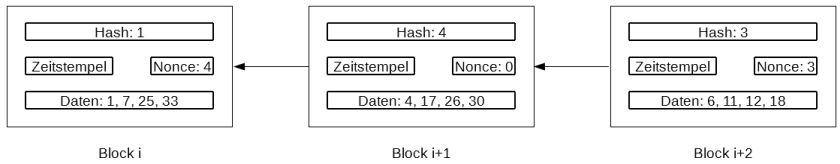

***

[<< zurück](02_toc.md)

***

# Sicherheit

Die nachfolgenden Ausführungen beziehen sich auf die Blockchain für Kryptowährungen. Andere Blockchains kommen ggf. ohne diese Mechanismen aus.

Blockchains sind dezentral über ein Peer-to-Peer-Netzwerk organisiert. Es gibt also keine zentrale Instanz, welche die Daten verwaltet oder die Echtheit von Transaktionen verifiziert. Um eine Blockchain dennoch gegen Manipulationen zu sichern, muss die Validierung neuer Daten von den Teilnehmern selbst durchgeführt werden. Die Teilnehmer einer Blockchain kommunizieren dazu untereinander.

## Proof of work

Im Kapitel Grundlagen(04_basics.md) wurde bereits das Mining von Blöcken angesprochen. Der Hashwert des Vorgängerblocks, den ein neuer Block enthalten muss, muss dabei bestimmte Eigenschaften aufweisen. Zu diesem Zweck muss eine zusätzliche Zeichenkette, die als Nonce bezeichnet wird, mit zufälligen Daten gefüllt werden. Anschließend wird der Hashwert über die Daten des Vorgängerblocks und die Nonce gebildet und überprüft, ob der Hashwert die Bedingungen erfüllt. Dieser Vorgang wird solange wiederholt, bis ein passender Hashwert entstanden ist. Möchte jemand einen neuen Block hinzufügen und kann für diesen einen gültigen Hashwert für den Vorgängerblock vorweisen, der den Bedingungen entspricht, beweist der Teilnehmer damit, dass er Arbeit (im Sinne von Rechenzeit) investiert hat, um den neuen Block zu erzeugen. Die Validierung des neuen Blocks durch die anderen Teilnehmer ist einfach, da diese lediglich einen Hashwert über die Daten des Vorgängerblocks und die neu erzeugte Nonce bilden und mit dem im neuen Block gespeicherten Hashwert vergleichen müssen. Der Beweis der erbrachten Arbeit ("Proof of work") in Form eines gültigen Hashwertes ermächtigt also zum Hinzufügen eines neuen Blocks. Da die dafür zu erbringende Arbeit nicht unerheblich ist, werden Manipulationen allein schon durch die dafür benötigte Rechenzeit stark eingeschränkt. [1]

Ein Nachteil dieses Verfahrens, der auch für viel Kritik sorgt, ist der hohe Stromverbrauch des Minings und die damit verbundenen Auswirkungen auf die Umwelt. Ferner besteht bei Kryptowährungen das Risiko, dass der Gewinn, der dem eigenen Wallet durch Hinzufügen eines neuen Blocks gutgeschrieben wird, durch die entstandenen Stromkosten zunichte gemacht wird.

## Proof of stake

Ein alternativer Konsens-Mechanismus ist der Proof of stake, bei dem alle Teilnehmer die Chance darauf haben, einen neuen Block zur Blockchain hinzufügen zu dürfen. Die Chance ist jedoch abhängig vom Vermögen im Wallet. Je höher das Vermögen, desto höher ist die Chance, für die Erzeugung eines neuen Blocks ausgewählt zu werden. 

Ein Mining ist hierbei nicht erforderlich, so dass dieses Verfahren keinen nennenswerten Stromverbrauch verursacht und eine entsprechend positivere Umweltbilanz aufweist. Es muss jedoch ein fairer Algorithmus zum Einsatz kommen, damit die reichen Teilnehmer nicht zu stark bevorzugt werden und damit ein immer größeres Guthaben erreichen, ohne dass die weniger vermögenden Teilnehmer auch zum Zuge kommen. [1]

## Proof of activity

Dieser Ansatz kombiniert Proof of work und Proof of stake. Ein neuer Block wird wie beim Proof of work durch Mining erzeugt. Er ist allerdings zunächst nicht aktiv. Erst nachdem dieser von anderen Teilnehmern nach dem Proof-of-stake-Mechanismus validiert wurde, wird er aktiviert. Die Belohnung für den neuen Block in Form von Anteilen der Kryptowährung wird unter allen Beteiligten aufgeteilt, so dass nicht nur das Mining, sondern ebenso das Validieren belohnt wird. [1]

## Die Sicherheit im Beispiel



Um die Sicherheit der Blockchain zu verdeutlichen, soll das Prinzip nachfolgend an einem Beispiel verdeutlicht werden. Zur Vereinfachung soll die Quersumme als Hash-Funktion ausreichen. Um eine feste Länge für die Quersumme zu erhalten, wird die Hash-Funktion nötigenfalls wiederholt, bis eine einstellige Zahl entsteht. Als Bedingung für den Hashwert sei gefordert, dass dieser kleiner als 5 sein muss. In der Praxis wäre diese Hash-Funktion natürlich ungeeignet, da sie nur 10 verschiedene Werte (nämlich die Ziffern 0-9) produziert, aber zu Anschauungszwecken soll dies genügen. In die Hash-Berechnung sollen die Daten und der Hash-Wert des Vorgängerblocks einfließen.

Wir betrachten zunächst Block i. Dieser enthält die Daten 1, 7, 25 und 33 sowie den Hash-Wert 1. Als einstellige Quersumme ergibt sich der Wert 4. Dieser ist bereits gültig, da er kleiner als 5 ist, so dass die Nonce in Block i+1 0 betragen kann und als Hash-Wert die errechnete 4 übernommen wird. 
Block i+1 enthält nun die Daten 4, 17, 26 und 30 sowie den Hash-Wert 4. Als einstellige Quersumme ergibt sich der Wert 9. Dieser ist kein gültiger Hash-Wert, so dass nun die Nonce benutzt werden muss, um einen gültigen Hash-Wert zu erzeugen. Mit Hilfe eines (Pseudo-)Zufallszahlengenerators werden nun Werte für die Nonce erzeugt, bis ein passender Wert gefunden wurde. Z.B. mit Nonce = 3 beträgt die Quersumme 3 und ist gültig. Für Block i+2 wird folglich der Wert 3 für die Nonce und der Wert 3 für die Quersumme eingetragen.

Würde nun jemand Block i verändern wollen und in den Daten statt der 1 eine 5 eintragen, würde dies in der Praxis von den überprüfenden Teilnehmern gar nicht akzeptiert werden, da ein Ändern bereits vorhandener Blöcke nicht vorgesehen ist. Blendet man diesen Umstand aus, ergibt sich dennoch ein Problem: Die Änderung von Block i hätte Auswirkungen auf alle folgenden Blöcke. Denn in Block i+1 müsste der Hash-Wert sich nun zusammen mit der dortigen Nonce von 0 aus 5, 7, 25, 33, dem Hash-Wert 1 und der Nonce 0 ergeben. Dies ergibt jedoch nicht den dort eingetragenen Wert 4, sondern den Wert 8. Dieser weicht nicht nur vom in Block i+1 eingetragenen Hash-Wert ab, sondern ist außerdem auch noch ungültig, da er nicht kleiner als 5 ist. In Block i+1 müsste also zunächst eine neue Nonce berechnet werden, die zu einem gültigen Hash-Wert führt. Die hätte jedoch wiederum Auswirkungen auf den Block i+2 sowie ggf. alle weiteren nachfolgenden Blöcke. Eine Manipulation der Blockchain wird auf diese Weise wirksam verhindert.

***

[<< Gefahren der Blockchain](07_risk_of_blockchain.md) | [Zukunft der Blockchain >>](09_future_of_blockchain.md)

***

```

Quellenangabe:

[01] - Jonas Verhoelen: Konsens-Mechanismen der Blockchain. Online-Artikel, erschienen am 16.10.2017, URL: https://blog.codecentric.de/2017/10/konsens-mechanismen-blockchain/

Medienverweise:

01 -  Sicherheit der Blockchain (eigene Arbeit)

```

***