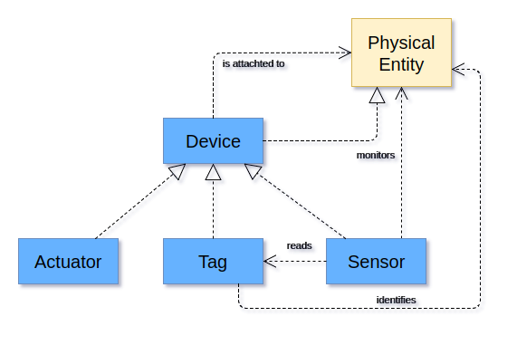
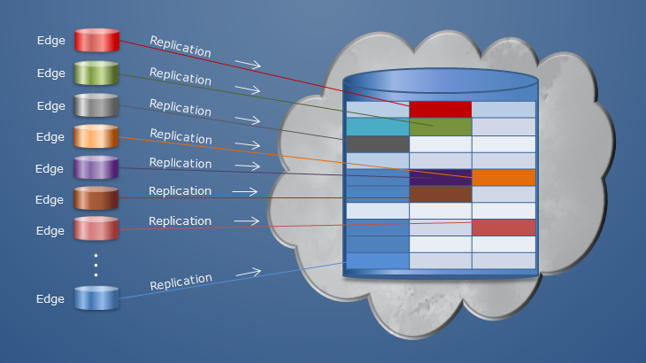

# IoT Architktur

Um die Anforderungen an eine Datenbank für IoT Systeme formulieren zu können, müssen zunächst die in einer IoT Architektur verwendeten Geräteklassen identifiziert werden. IoT ist vereinfacht gesagt ein Verbund aus Geräten die Daten aus der Umwelt sammeln, diese speichern und für weitere Prozesse zur Verfügung stellen, die wiederum diese Geräte steuern können und so mit der Umwelt interagieren.

In einer ausgearbeiteten Referenz Architektur, der IoT-A, werden die Geräte in zwei Klassen unterteilt (siehe Abb. 1).
Zum Einen in die Klasse der Devices, welche die konkreten Hardware wie Sensoren, RF-Tags oder Aktoren nennt. Zum Anderen existiert die Klasse der Physischen-Entitäten, welche die Anbindung von Devices vornehmen und durch spezielle Software die angebundenen Devices kontextabhängig verarbeiten bzw. steuern kann. Im Grunde stellt die Klasse der Physischen-Entität das eigentliche Thing aus dem Internet of Things dar und kann so z.B. ein Kühlschrank, ein Auto oder auch größer gefasst, ein Haus darstellen. [5]

Abb. 1: Auszug aus dem Referenzmodell IoT-A [5]

Die einzelnen Physischen-Entitäten besitzen, bezogen auf ihre Aufgaben, eigene Prozessorkapazitäten und Speicher sowie Kommunikationschnittstellen zu anderen Geräten und können somit autark arbeiten und mit anderen kommunizieren. Im folgenden wird die Bezeichnung IoT-Gerät verwendet. [5]

Um die Daten an einer zentralen Stelle zusammenführen zu können, werden große zentrale Datenbanken eingesetzt, in welche die einzelnen Geräte Daten einspielen können. Im Folgenden wird hierfür der Begriff Cloud genutzt, welcher sich nicht nur auf öffentliche Clouds bezieht und sich in der Literatur neben Data-Center durchgesetzt hat.

Da ein IoT-Gerät sehr viele Daten in kurzer Zeit erzeugen kann, werden diese meist über Gateways angebunden. Ein Gateway bildet für mehrere IoT-Geräte eine eigene Domäne. Die so so erzeugen Unternetze werden aus Sicht der Cloud als Edge-Systeme bezeichnet. Als Beispiel sei hier ein Haus genannt, in dem mehrere IoT-Geräte wie Heizungsthermostate und Brandmelder installiert und an dem Gateway über unterschiedliche Technologien angeschlossen sind. Das Gateway besitzt nun die Aufgaben diese verschiedenen Datenströme auf ein einheitliches Protokoll zu bringen, damit die Daten an die Cloud übergeben werden können. Des Weiteren kann das Gateway weitere Steuerungsfunktionen übernehmen oder bereits Analysemethoden bereitstellen. [12] Ebenfalls Aufgabe eines Gateways ist die vom IoT-Gerät kommenden Daten ggf. zu aggregieren, um so eine Reduktion der Daten in Richtung Cloud zu ermöglichen. Die Übertragung der Daten in die Cloud erfolgt meist durch Replikation, so dass die Daten auch nach der Übertragung noch auf dem Gateway, also dem Edge-System, zur Verfügung stehen.
[6]

Abb. 2: Datenreplikation aus Edge-System in Cloud [6]

In Abb. 2 ist zu erkennen, wie eine typische Replikation der Daten von IoT-Geräten/Gateways in eine Cloud aussieht. Die zu replizierenden Daten bilden in einem Edge-Systeme eine eigene logische Einheit. In der Cloud werden diese Einheiten wiederum zu einer großen logischen Einheit zusammen gesetzt
[6]

Die zur Verfügung stehenden Ressourcen der einzelnen Komponenten fallen sehr unterschiedlich aus.

Ein Device, meist ein Tag, Sensor oder Aktor, besitzt wenig Ressourcen, damit dies günstig produziert werden können und nicht viel Energie verbrauchen. Sie besitzen meist nur kleine schwache Prozessoren mit sehr wenig Speicher und haben meist nur sehr wenig Flashspeicher für eine Firmware bzw. deren Konfiguration.

Abb. 3 Zusammenhang Device, IoT-Gerät, Gateway und Cloud

Ein IoT-Gerät (vgl. Abb. 3) bündelt mehrere Devices und besitzt meist mehr Prozessorleistung und Speicher. Um mit den begrenzten Ressourcen eines solchen Umgebung umgehen zu können, werden meist spezialisierte Echtzeit-Betriebssysteme eingesetzt. Im oben genannten Beispiel unserer Hauses, wäre hier ein Einplatinen-Computer zu nennen, welcher die verschiedenen Brandmelder konsolidiert. Es können hier auch schon Funktionen implementiert werden, die das IoT-Gerät "Telefon" bei einem Alarm informiert, welches dann einen Notruf absetzt.

Ein Gateway, welches IoT-Geräte konsolidiert und eine einheitliche Verbindung zur Cloud herstellt, besitzt meist mehr Prozessorpower und Speicher, um mögliche Datenaggregationen durchführen zu können. Ebenso stellen viele Gateways auch Analysefunktionen bereit und speichern für ein Edge-System die erhaltenen Daten. Bei kleineren Netzen können die IoT-Geräte auch selbst die Daten an die Cloud senden und teilweise Gateway-Funktionen mit implementieren.

Die Cloud selbst ist die ressourcenlastigste Komponente in der IoT-Architektur. Sie wird bei großen Systemen mit tausenden Anfragen pro Minute. bombardiert und muss diese Datenmengen speichern und den Anwendern Echtzeit-Zugriffe auf diese gewähren.
[12]
