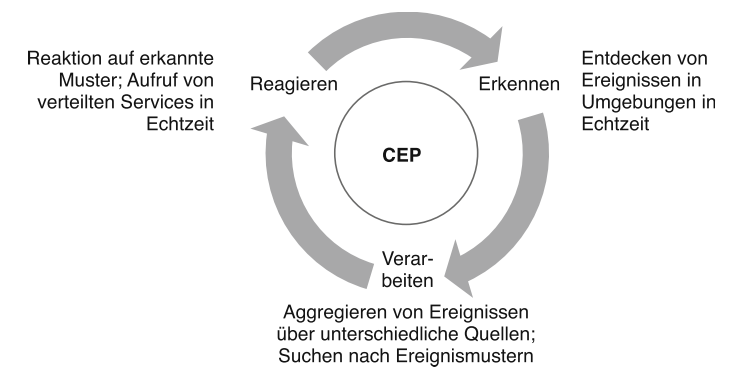
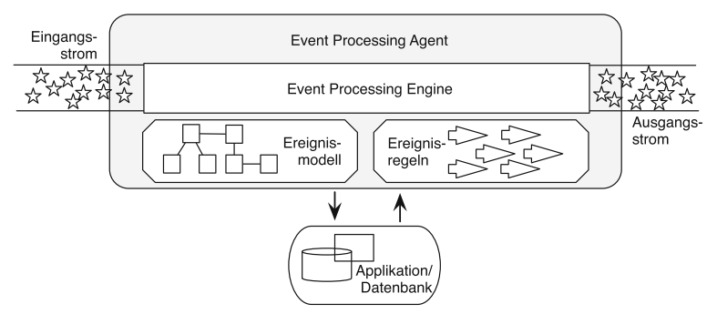
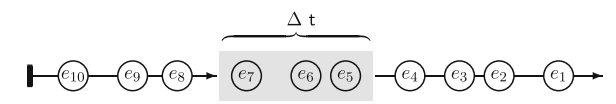
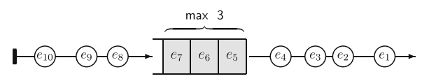
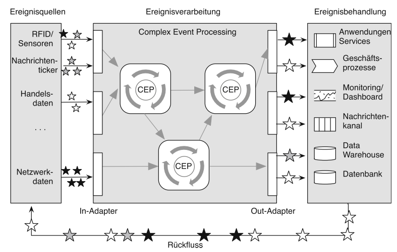

***

[<< zurück](04_basics.md)

***

# Technologie

Dieses Kapitel befasst sich mit der grundlegenden Technologie nach der das Event-Stream-Processing arbeitet. Grundlegendes Ziel ist dabei aus einem primitiven Ereigniststrom durch Abstraktion abstraktere Ereignisse zu erkennen. Die folgende Abbildung verdeutlich noch einmal diesen Ansatz.


## Grundzyklus ereignisverarbeitender Systeme

Systeme die speziell für die Verarbeitung von Ereignissen entwickelt wurden, basieren auf einem üblichen Zyklus aus drei Teilen: Erkennen, Verarbeiten und Reagieren. [1]

1. Beim **Erkennen** werden die Ereignisse als Teil der Realität interpretiert und in Echtzeit verarbeitet.
2. Bei der **Verarbeitung** analysiert das System die Daten um Muster zu erkennen. Die Analyse kann auf einen oder mehreren Datenströmen durchgeführt werden.
3. Beim **Reagieren** löst das System Aktionen auf Basis der analysierten Daten aus. Es kann sich um Warnmeldungen, auslösen von Geschäftsprozessen oder Information von Benutzern handeln.



## Event Processing Agent

Der vorgestellte Grundzyklus wird von einem sogenannten Event Processing Agenten umgesetzt. Der Agent verarbeitet einen Ereignisstrom und erzeugt einen entsprechenden Ausgangsstrom. Zur Realisierung der Verarbeitung erhält der Event Processing Agent folgende Artefakte:

- Ein **Modell** der zu erwartenden Ereignisse inkl. Datentypen und Beziehungen.
- **Ereignisregeln** bestehend aus einem Bedingungsteil und einem Aktionsteil. Der Bedingungsteil beschreibt ein oder mehrere verknüpfte Muster. Die Formulierung von Ereignisregeln erfolgt in sogenannten Event Processing Languages. Eine konkrete Sprache betrachten wir im folgenden Kapitel Projekte.
- Je nach Einsatzszenario erhält der Agent über eine Datenbank oder einen Dienst Zugriff auf weiteres Kontextwissen. [1]

Die tatsächliche Verarbeitung und damit die Mustererkennung erfolgen in der **Event Processing Engine**, diese ist Teil des Agenten. Die Engine gleicht kontinuierlich die eintreffenden Ereignisse mit den Regeln ab. Um entsprechende Muster zu erkennen hält die Engine Ereignisse im Arbeitsspeicher. Da dieser begrenzt ist, sind hierfür spezielle Strategien notwendig. [3] 



Damit die Engine die Ereignisse möglichst in Echtzeit verarbeiten kann, erfolgt vorab eine **Filterung** der Ereignisse. Dabei prüft der Filter, ob die Engine den Ereignistyp überhaupt verarbeitet. In konkreten Szenarien treten Ereignisse auch doppelt auf, da sie beispielsweise von mehreren Sensoren erfasst werden. Auch diese werden gefiltert. [2]

Nach dem Filtern bereitet der **Präprozessor** die Daten der Ereignisse auf. Hierbei handelt es sich um typische Aufgaben wie Validierung der Daten, Anreicherung der Daten und Wandlungen des Formats. Der Präprozessor stellt darüberhinaus sicher, dass die Ereignisse den für den Engine korrekten Zeitstempel aufweisen und stellt sicher, dass die Ereignisse in der richtigen Reihenfolge verarbeitet werden. Dies ist notwendig da die Ereignisse aus verschiedenen Quellen stammen können.

### Auswertungsfenster

Die Engine muss die Ereignisse zur Verarbeitung auswählen, da bei einem endlosen Ereignisstrom nicht alle Daten gespeichert werden können. Hierfür haben sich verschiedene Strategien entwickelt. Eine Möglichkeit besteht in **gleitenden Zeit- und Längenfenstern**.

Bei einem gleitenden Zeitfenster steht jeweils ein bestimmtes Zeitfenster zur Verfügung. Hier können jeweils unterschiedliche viele Ereignisse enthalten sein. Zum Verschieben des Zeitfensters gibt es weitere unterschiedliche Verfahren. Die folgende Abbildung zeigt ein gleitendes Zeitfenster.



Im Gegensatz zum Zeitfenster kommt bei dem Längenfenster die Angabe einer festen Größe zum Einsatz.



Beim Verschieben eines **Sliding-Window** gibt es abhängig vom Faktor mit dem das Fenster verschoben wird drei mögliche Folgezustände:

- Die Fenster überlappen sich. Es handelt sich um ein Rolling-Window.
- Die Fenster schließend direkt aneinander an. Es handelt sich um ein Tumbling-Window.
- Zwischen den Fenstern liegt eine Lücke.

Beim Landmark Window handelt es sich um ein gleitendes Fenster mit einem festen Zeitpuntk als Endzeitpunkt. Beispielsweise jeden Tag um 24 Uhr. [2]

### Event Consumption Modes

Die verschiednen Fensterarten bieten eine Möglichkeit Ereignisse zur Verarbeitung einzugrenzen. Es gibt auch weitere Strategien Ereignisse auszuwählen. Bei den Kontextstrategien wird das Verhalten abstrakter Mustererkenner beschrieben. Hier liegen viele verschiedene Strategien vor. Es sollen nur Auszugsweise ein paar Ansätze beschrieben werden.

- Beim Recent Consumption Mode wird ein Event des Typs A immer dem nächsten Ereignis des Typs B zugeordnet.
- Beim Continous Consumption Mode werden alle Events des Typs A mit einem Mustererkenner verarbeitet bis ein Event B auftritt. Dann beginnt der Mustererkenner von vorne.[2]


## Event Processing Network

Zur Realisierung komplexer Verarbeitungsschritte wird das Devide und Conquer Prinzip angewendet. Mehrere Event Processing Agenten werden verknüpft und bilden jeweils einen Teilschritt ab. [1]

Eine derartige Event-Driven Architecture basiert auf drei Ebenen:

- **Ereignisquellen**: Entitäten die Objekte überwachen und Ereignisse publizieren oder Objekte die selbst Ereignisse erzeugen. Auch Ereignisverarbeitende Entitäten stellen selbst wiederum Ereignisse zur Weiterverarbeitung bereit. Beispiele: Sensoren, Web Services, Datenticker, RFID-Lesegeräte, Benutzerinteraktionen, E-Mail, interne Uhren.
- **Ereignisverarbeitung**: Die Ereignisverarbeitung erfolgt wie bereits beschrieben über Event Processing Agenten mittels eines Regelsatzes.
- **Ereignisbehandlung**: Verantwortlich für die Ereignisbehandlung der ausgewerteten Datenströme sind Unternehmensanwendungen im Backend. Typische Aktionen sind hier: Aufruf von Diensten, Aktualisierung eines Dashboards, Publizieren einer Nachricht für registrierte Anwendungen, Auslösen eines menschlichen Prozesses.



Innerhalb des Netzwerks spricht man auch von einer Event Cloud. Damit ist nur gemeint, dass alle Ereignisquellen ihre Ereignisse zentral zur Verfügung stellen und die verarbeitenden Agenten sich hierfür registrieren können. Dabei kann der Agent bereits bestimmen welche Ereignistypen er erhalten möchte. [2]

***

[<< Grundlagen](04_basics.md) | [Projekte >>](06_projects.md)

***

```

Quellen:

[1] Bruns, Ralf; Dunkel, Jürgen (o.J.): Complex Event Processing im Überblick, Seite 7f.

[2] Hedtstück, Ulrich (2017): Complex Event Processing. Berlin, Heidelberg: Springer Berlin Heidelberg, Seite 22f.

[3] David B. Robins (2010): Complex Event Processing, University of Washington, Seite 2.

Bildnachweis:

[1] Bruns, Ralf; Dunkel, Jürgen (o.J.): Complex Event Processing im Überblick, Seite 5.

[2] Bruns, Ralf; Dunkel, Jürgen (o.J.): Complex Event Processing im Überblick, Seite 6.

[3] Bruns, Ralf; Dunkel, Jürgen (o.J.): Complex Event Processing im Überblick, Seite 13.

[4] Hedtstück, Ulrich (2017): Complex Event Processing. Berlin, Heidelberg: Springer Berlin Heidelberg, Seite 26.

[5] Hedtstück, Ulrich (2017): Complex Event Processing. Berlin, Heidelberg: Springer Berlin Heidelberg, Seite 26.

[6] Bruns, Ralf; Dunkel, Jürgen (o.J.): Complex Event Processing im Überblick, Seite 15.

```

***


