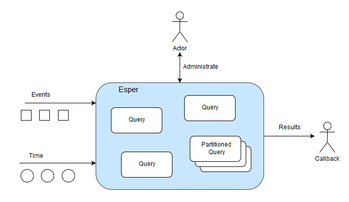

# Projekte

Nach der Betrachtung der grundlegenden folgt in diesem Kapitel ein Blick auf verschiedene konkrete Projekte, die sich mit der Verarbeitung von Ereignisströmen befassen. Es tauchen auch Projekte auf, die sich nicht explizit mit der Verarbeitung von Ereignissen befassen, sondern die Verarbeitung von Datenströmen im allgemeinen realisieren. An dieser Stelle geht es nicht um einen vollständigen Überblick über alle existierenden Projekte sondern vielmehr in einzelne Einblicke.

Projekte ist an dieser Stelle ein weit gefasster Begriff. Die vorgestellten Projekte sind zum Teil Frameworks zur Realisierung von Event-Stream-Processing in einer spezifischen Programmiersprache, konkreten Anwendungen oder Vorschläge zur Umsetzung auf Basis einer Plattform.

## Überblick

Die folgende Abbildungen zeigt eine Übersicht über Projekte im Event-Stream-Processing Umfeld. Sie sind natürlich nicht geeignet einen detaillierten Einblick zu liefern. Jedoch wird deutlich wie groß das Angebot an der Stelle ist.Die Abbildung zeigt die von den Autoren identifizierten Keyplayer im ersten Quartal im Jahr 2016. Sie ist explizit nicht vollständig. Es wird aber deutlich, dass bekannte Größen wie IBM, SAP, Software AG, Microsoft, Apache, Oracle und viele weitere vertreten sind.


## Esper

Esper stellt einen Container zur Ausführung von Event-Processing-Language (EPL) Queries bereit. Esper bietet somit ein Framework für die Java-Sprache und eine entsprechende Ausführungsumgebung auf Basis der Java-Virtual-Machine bereit. Neben Java exisitert auch eine .NET Realisierung Namens NEsper. [1]



Damit der Esper Container funktionsfähig ist, sind folgende Dinge notwendig:

1. Über die Administrationsschnittstelle werden **EPL Queries** registriert.
2. Ebenso müssen **Callbacks** zur Verarbeitung der Queries erstellt werden.
3. Der vorbereitete Container muss nun entsprechende **Events** erhalten.
4. Zudem muss die **Zeit** des Containers gesteuert werden.

Einige Codebeispiele sollen das vorgestellte verdeutlichen.

### Einfaches Beispiel PersonEvent

In diesem sehr einfachen Beispiel werden alle notwendigen Aktionen durchgeführt um mit Esper ein einfaches Event zu verarbeiten. Das Beispiel stammt aus der Einführung von Esper.
Zunächst benötigen wir unsere Verarbeitungsengine. Hier nutzten wir den Defaultprovider.

```java
EPServiceProvider engine = EPServiceProviderManager.getDefaultProvider();
```

Wie bereits in den Grundlagen erläutert muss das zu verarbeitende Event entsprechend definiert werden. In unserem Beispiel wird ein einfaches Plain-Old-Java-Object (POJO) verwendet. Unser Objekt heißt PersonEvent mit den Klassenvariablen name und age.
Diesen Eventyp geben wir bekannt.

```java
engine.getEPAdministrator().getConfiguration().addEventType(PersonEvent.class);
```

Es können jedoch nicht nur Java-Objekte als Event registriert werden. Auch ein XML-Schema oder eine Angabe der Objekt Parameter ist möglich.
Als nächstes erfolgt die Registrierung einer einfachen Query.

```java
String epl = "select name, age from PersonEvent";
EPStatement statement = engine.getEPAdministrator().createEPL(epl);
```

Es handelt sich um einer sehr einfache Abfrage. Komplexere Abfragen werden später vorgestellt.
Bei der Registrierung der EPL-Query erhalten wir ein Statement über dieses Statement können wir Callbacks definieren. Also ausführbaren Code der auf Basis der Query ausgeführt wird. In diesem Beispiel werden nur die Werte aus der Datenstruktur ausgelesen und in der Konsole ausgegeben.

```java
statement.addListener( (newData, oldData) -> {
  String name = (String) newData[0].get("name");
  int age = (int) newData[0].get("age");
  System.out.println("String.format(Name: %s, Age: %d", name, age));
});
```

Über die Runtime können Events an den Container übermittelt werden. 

```java
engine.getEPRuntime().sendEvent(new PersonEvent("Peter", 10));
```

Auf der Konsole erfolgt eine entsprechende Ausgabe. Diese sieht wie folgt aus.

```
Name: Peter, Age: 10
```

## Aurora

## Odysseus

## Google Cloud Architecture

https://cloud.google.com/solutions/architecture/complex-event-processing

## Apache Spark

https://www.accenture.com/us-en/blogs/blogs-a-closer-look-at-complex-event-processing-tools

http://blog.cloudera.com/blog/2015/11/how-to-build-a-complex-event-processing-app-on-apache-spark-and-drools/

## Beispiel IBM

https://www.research.ibm.com/haifa/dept/services/papers/cep_Jan07_nc.pdf

***

```

Quellen:

[1] Esper (o.J.): Esper Reference online unter: http://esper.espertech.com/release-7.0.0/esper-reference/html/gettingstarted.html

Bildnachweis:

[1] Vincent, Paul (2016): Blog Real Time Intelligence & Complex Event, CEP Tooling Market Survey 2016 online unter:  Processinghttp://www.complexevents.com/2016/05/12/cep-tooling-market-survey-2016/

[2] Esper (o.J.): online unter: http://esper.espertech.com/release-7.0.0/esper-reference/html/processingmodel.html

```

***


