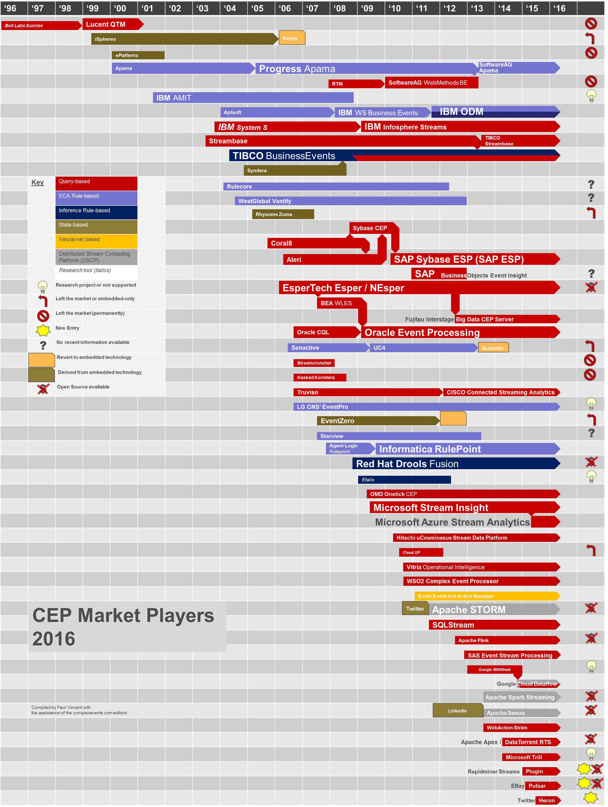
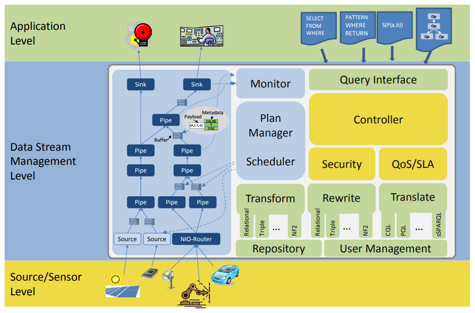
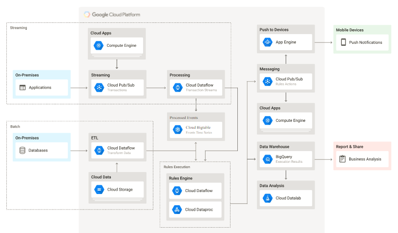

***

[<< zurück](05_technology.md)

***

# Projekte

Nach der Betrachtung der grundlegenden folgt in diesem Kapitel ein Blick auf verschiedene konkrete Projekte, die sich mit der Verarbeitung von Ereignisströmen befassen. Es tauchen auch Projekte auf, die sich nicht explizit mit der Verarbeitung von Ereignissen befassen, sondern die Verarbeitung von Datenströmen im allgemeinen realisieren. An dieser Stelle geht es nicht um einen vollständigen Überblick über alle existierenden Projekte sondern vielmehr in einzelne Einblicke.

Projekte ist an dieser Stelle ein weit gefasster Begriff. Bei Esper handelt es sich im weitesten Sinne um eine Framework, Odysseus ist ein Beispiel für eine vollständige, Google Cloud Dataflow realisiert das Apache Beam Interface für Streamverarbeitung.

## Überblick

Die folgende Abbildungen zeigt eine Übersicht über Projekte im Event-Stream-Processing Umfeld. Sie sind natürlich nicht geeignet einen detaillierten Einblick zu liefern. Jedoch wird deutlich wie groß das Angebot an der Stelle ist.Die Abbildung zeigt die von den Autoren identifizierten Keyplayer im ersten Quartal im Jahr 2016. Sie ist explizit nicht vollständig. Es wird aber deutlich, dass bekannte Größen wie IBM, SAP, Software AG, Microsoft, Apache, Oracle und viele weitere vertreten sind.



## Esper

Esper stellt einen Container zur Ausführung von Event-Processing-Language (EPL) Queries bereit. Esper bietet somit ein Framework für die Java-Sprache und eine entsprechende Ausführungsumgebung auf Basis der Java-Virtual-Machine bereit. Neben Java exisitert auch eine .NET Realisierung Namens NEsper. [1]


Damit der Esper Container funktionsfähig ist, sind folgende Dinge notwendig:

1. Über die Administrationsschnittstelle werden **EPL Queries** registriert.
2. Ebenso müssen **Callbacks** zur Verarbeitung der Queries erstellt werden.
3. Der vorbereitete Container muss nun entsprechende **Events** erhalten.
4. Zudem muss die **Zeit** des Containers gesteuert werden.

Einige Codebeispiele sollen das vorgestellte verdeutlichen.

### Einfaches Beispiel PersonEvent

In diesem sehr einfachen Beispiel werden alle notwendigen Aktionen durchgeführt um mit Esper ein einfaches Event zu verarbeiten. Das Beispiel stammt aus der Einführung von Esper.
Zunächst benötigen wir unsere Verarbeitungsengine. Hier nutzten wir den Defaultprovider.

```java
EPServiceProvider engine = EPServiceProviderManager.getDefaultProvider();
```

Wie bereits in den Grundlagen erläutert muss das zu verarbeitende Event entsprechend definiert werden. In unserem Beispiel wird ein einfaches Plain-Old-Java-Object (POJO) verwendet. Unser Objekt heißt PersonEvent mit den Klassenvariablen name und age.
Diesen Eventyp geben wir bekannt.

```java
engine.getEPAdministrator().getConfiguration().addEventType(PersonEvent.class);
```

Es können jedoch nicht nur Java-Objekte als Event registriert werden. Auch ein XML-Schema oder eine Angabe der Objekt Parameter ist möglich.
Als nächstes erfolgt die Registrierung einer einfachen Query.

```java
String epl = "select name, age from PersonEvent";
EPStatement statement = engine.getEPAdministrator().createEPL(epl);
```

Es handelt sich um einer sehr einfache Abfrage. Komplexere Abfragen werden später vorgestellt.
Bei der Registrierung der EPL-Query erhalten wir ein Statement über dieses Statement können wir Callbacks definieren. Also ausführbaren Code der auf Basis der Query ausgeführt wird. In diesem Beispiel werden nur die Werte aus der Datenstruktur ausgelesen und in der Konsole ausgegeben.

```java
statement.addListener( (newData, oldData) -> {
  String name = (String) newData[0].get("name");
  int age = (int) newData[0].get("age");
  System.out.println("String.format(Name: %s, Age: %d", name, age));
});
```

Über die Runtime können Events an den Container übermittelt werden. 

```java
engine.getEPRuntime().sendEvent(new PersonEvent("Peter", 10));
```

Auf der Konsole erfolgt eine entsprechende Ausgabe. Diese sieht wie folgt aus.

```
Name: Peter, Age: 10
```

Das Beispiel ist insgesamt sehr einfach gehalten. Der folgende Abschnitt geht stärker auf die Möglichkeiten der EPL-Queries ein.

### EPL-Queries

Die Abfragen auf Basis der Event-Processing-Language die Esper zur Verfügung stellen, haben eine große Ähnlichkeit mit SQL-Abfragen. EPL-Abfragen bieten einen ähnlichen Funktionsumfang: Selects, Aggregation, Auswahl (Filter genannt) und vieles mehr. Die folgenden Beispiele wollen den Unterschied verdeutlichen.

Im Technologie Abschnitt haben wir uns mit unterschiedlichen Möglichkeiten Daten auszuwählen und im Arbeitsspeicher vorzuhalten um auf mehreren Events zu arbeiten. Das folgende Beispiel zeigt eine **Data-Length-Window**. Der Callback erhält so beim Aufruf die letzten 5 Events zur Verarbeitung.
 
```
select * from PersonEvent#length(5)
```

Zudem bietet uns die EPL Möglichkeiten **Muster** in Events zu erkennen. Dieses Beispiel zeigt noch ein paar weitere Features wie ein global definiertes Datenfenster und Partitionierung. Hier geht es jedoch vor allem um das definierte Muster *pattern (a1 a2)*. A1 ist definiert als high und a2 definiert als medium. Das Muster trifft also zu wenn ein Event mit priority medium auf ein event mit priority high folgt.

```SQL
select * from AlertNamedWindow
  match_recognize (
    partition by origin
    measures a1.origin as origin, a1.alarmNumber as alarmNumber1, a2.alarmNumber as alarmNumber2
    pattern (a1 a2)
    define
      a1 as a1.priority = 'high',
      a2 as a2.priority = 'medium'
)
```

Bei der Erkennung von Mustern gibt es viele verschiedene Option. Bei der Verarbeitung von Eventdatenströmen spielt natürlich auch **Zeit** eine bedeutende Rolle. Das Ziel des folgenden Statements besteht darin alle Events zu selektieren die in den letzten zwei Stunden die Summe der Preise aufeinanderfolgenden Events ServiceOrder und ProductOrder innerhalb einer Minute den Wert 100 übersteigen.
In dem Beispiel treten direkt zwei unterschiedliche Zeitoptionen auf. Einmal wird *timer:withing(1 min)* verwendet. Damit wird spezifiziert, dass das Event *ProductOrder* innerhalb von einer Minute auf das Event ServiceOrder folgen muss. Bei den auftretenden Events muss die Kunden-ID gleich sein.
Die zweite Zeitangabe *[...]#time(2 hour)* spezifiziert die Auswahl der Events auf einen Zeitraum der letzten zwei Stunden.

```SQL
select a.custId, sum(a.price + b.price)
from pattern [every a=ServiceOrder -> 
    b=ProductOrder(custId = a.custId) where timer:within(1 min)]#time(2 hour) 
where a.name in ('Repair', b.name)
group by a.custId
having sum(a.price + b.price) > 100
```

Die hier gezeigten Beispiele sind nur ein Ausschnitt der Möglichkeiten. Der Unterschied zwischen SQL und der Esper EPL sollte jedoch deutlich geworden sein.

## Odysseus

Die Uni Oldenburg hatte von 2007 bis 2014 ein Projekt Namens Odysseus zur Entwicklung einer Umgebung zum Event-Stream-Processing. Die Anwendung besteht aus einer Server Komponente und einer Grafischenoberfläche zur Verwaltung. Die folgende Abbdilung stellt die einezlnen Komponenten mit Monitor, Query-Interface, Schedueler etc. dar. [2]



Odysseus wird an dieser Stelle als eine Möglichkeit zur Umsetzung von Eventverarbeitung über eine fertige Anwendung aufgeführt. Die Anwendung wird ebenfalls über eine SQL ähnliche Abfragesprache mit Queries versorgt und bietet verschiedene Möglichkeiten mit Ergebnissen umzugehen. Das nächste Projekt stellt eine Umsetzung auf Basis eines Platform-as-a-Service Angebots dar.

## Google Cloud Architecture & Apache Beam

Auch in unterschiedlichen Cloud Umgebungen existieren verschiedene Lösungsansätze zur Verarbeitung von Event-Streams. An dieser Stelle wird die Lösung von Google vorgestellt. Diese Lösung basiert im Kern auf den Löseungen Cloud Pub/Sub und **Cloud Dataflow**. Pub/Sub realisiert die eigentlichen Event-Streams stellt also das Messingsystem zur Verfügung. Die Verarbeitung der Events erfolgt in der Dataflow Lösung. Die Dataflow Lösung stellt eine Verarbeitung auf Basis von Pipelines dar. Dabei stellt Dataflow eine  Implementierung der Apache Beam API dar. Weitere Implementierungen der Apache Beam API stellen unter anderem IBM Streams, Apache Flink, Apache Spark und JStorm dar. Die Architektur in der folgenden Abbildung stellt auch die Möglichkeit dar über Pub/Sub zusätzlich zur Echtzeit Verarbeitung von Ereignissen auch die Batch-Verarbeitung zu integrieren. [3] 



Es folgt eine Betrachtung einer einfachen Pipeline mit Apache Beam. Zuerst erstellen wir eine Pipeline. Dafür müssen noch einige Dataflow Optionen angegeben werden.

```java
PipelineOptions options = PipelineOptionsFactory.create();

// Options for Google Dataflow 
DataflowPipelineOptions dataflowOptions = options.as(DataflowPipelineOptions.class);
dataflowOptions.setRunner(DataflowRunner.class);
dataflowOptions.setProject("Datenbanktechnologien Hausarbeit");
dataflowOptions.setTempLocation("gs://bucket/tempDir");

Pipeline p = Pipeline.create(options);
```

Die nächste Zeile sorgt für die Eingabe der Pipeline. Es werden Textdateien aus einem Verzeichnis gelesen. Die nächsten Schritte der Pipline werden jeweils eine Zeile der zurückgegebenen Collection verarbeiten.

```java
p.apply(TextIO.read().from("gs://apache-beam-samples/shakespeare/*"))
```

Der nächste Schritt in der Pipeline verarbeitet die Zeilen in einzelne Wörter. Es handelt sich um eine anonyme Implementierung des DoFn-Interfaces.

```java
.apply("ExtractWords", ParDo.of(new DoFn<String, String>() {
    @ProcessElement
    public void processElement(ProcessContext c) {
        // \p{L} denotes the category of Unicode letters,
        // so this pattern will match on everything that is not a letter.
        for (String word : c.element().split("[^\\p{L}]+")) {
            if (!word.isEmpty()) {
                c.output(word);
            }
        }
    }
}))
```

Es gibt aber auch vordefinierte Schritte. Das zählen der Wörter erfolgt mit einer entsprechenden Implementierung.

```java
.apply(Count.<String>perElement())
```

Zum Abschluss erfolgt noch eine Transformation und eine Ausgabe.

```java
.apply("FormatResults", MapElements.via(new SimpleFunction<KV<String, Long>, String>() {
    @Override
    public String apply(KV<String, Long> input) {
        return input.getKey() + ": " + input.getValue();
    }
}))
.apply(TextIO.write().to("wordcounts"));
```

Die Ausführung erfolgt über die run() Methode. Ab hier übernimmt der jeweilige Runner und führt die Pipeline aus.

```java
p.run().waitUntilFinish();
```

Das hier vorgestellte Beispiel kommt ohne eine besondere Sprache wie die Esper-EPL aus. Es gibt aber auch ähnliche Features wie die typischen Windows. Hierbei werden mehrere Elemente in der Pipelines gruppiert. Dies entspricht dem wesentlichen Verhalten der Windows in der Esper-EPL. [4]

***

[<< Technologie](05_technology.md) | [Fazit >>](07_conclusion.md)

***

```

Quellen:

[1] Esper (o.J.): Esper Reference, online unter: http://esper.espertech.com/release-7.0.0/esper-reference/html/gettingstarted.html

[2] Uni Oldenburg (o.J.): Projektseite Odysseus, online unter: http://odysseus.informatik.uni-oldenburg.de/index.php

[3] Google (2017): Vorstellung Complex Event Processing, online unter: https://cloud.google.com/solutions/architecture/complex-event-processing

[4] Apache Beam (o.J.): Projektseite, online unter: https://beam.apache.org

Bildnachweis:

[1] Vincent, Paul (2016): Blog Real Time Intelligence & Complex Event, CEP Tooling Market Survey 2016 online unter:  Processinghttp://www.complexevents.com/2016/05/12/cep-tooling-market-survey-2016/

[2] Esper (o.J.): online unter: http://esper.espertech.com/release-7.0.0/esper-reference/html/processingmodel.html

[3] Odysseus (2010): online unter: http://odysseus.informatik.uni-oldenburg.de/fileadmin/files/ArchitekturOdysseusOkt2010_-_Logo.pdf

[3] Google (2017): online unter: https://cloud.google.com/solutions/architecture/complex-event-processing

```

***


