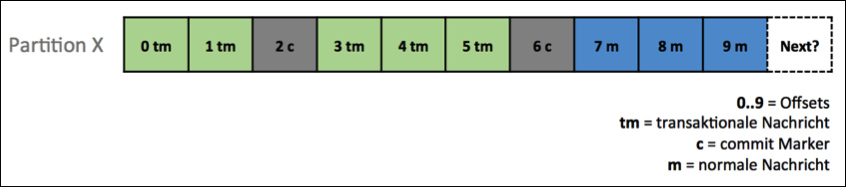
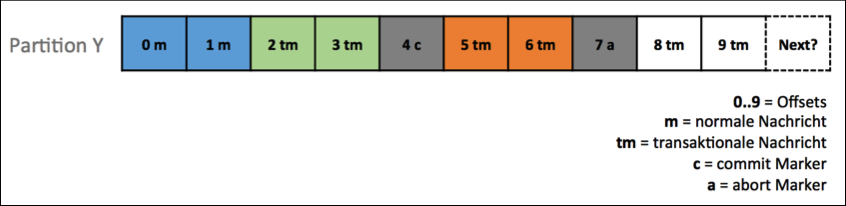

# Die „exactly once“-Semantik

Die „exactly once“-Semantik gehört zu den sogenannten „messaging semantics“. Es handelt sich also um eine Semantik in der Nachrichtenübertragung.
Bevor im Detail auf „exactly once“ eingegangen wird, soll allerdings kurz ein Überblick über weitere relevante Semantiken gegeben werden.

## Semantiken

„At least once“: Eine Nachricht wird wenigstens einmal gesendet. Wenn der Broker keine Acknowledge-Nachricht erhält geht er davon aus, dass die Nachricht nicht erhalten wurde und sendet diese erneut. Dies kann zu Duplikaten führen. [confluent2017-07]

„At most once“: Eine Nachricht wird höchstens einmal gesendet. Im wesentlichen werden die Acknowledge-Nachrichten ignoriert. Der Producer sendet seine Daten und diese werden unabhängig von der Acknowlegde-Nachricht kein weiteres Mal gesendet. [confluent2017-07]

„Exactly once“: Eine Nachricht wird exakt einmal gesendet, auch wenn der Producer ein weiteres Mal versucht die Nachricht zu übertragen. [confluent2017-07]

## Problematiken

In der Realität gibt es einige Probleme, die mit verteilten Systemen einhergehen und somit auf das Kafka-System zutreffen. [confluent2017-07]

* Ein Broker kann ausfallen,
* ein Producer zu Broker RPC (Remote Procedure Call) kann nicht ankommen und
* ein Client kann ausfallen

Trotz allem sagen die Entwickler von Kafka, dass „exactly once“ möglich ist. Aus diesem Grund soll im folgenden darauf eingegangen werden, wie Kafka diese Problematik löst.

Zunächst einmal können in einem Kafka-System n - 1 Broker ausfallen bevor das System komplett ausfällt, wobei n für die Anzahl aller Broker im System steht. [confluent2017-07]
Das Kafka-System basiert auf Acknowledge-Nachrichten. Erhält der Broker keine solche Nachricht geht er davon aus, dass die ursprüngliche Nachricht nicht erhalten wurde und sendet diese erneut. Damit wird sichergestellt, dass RPCs ankommen. [confluent2017-07]
Des Weiteren hält Kafka das Output-Offset mit dem produzierten Output synchron, um so Client-Ausfällen entgegen zu wirken.
Im Einzelnen sind es allerdings drei Mechanismen, die für die „exactly once“-Semantik sorgen: [confluent2017-07]

* Indempotenz,
* Transaktionen und
* Stream-Processing

**Idempotenz**
Um idempotente Aktionen zu erreichen werden den Nachrichtenbündeln Sequenznummern hinzugefügt. Diese werden auch in das Log geschrieben, so dass beispielsweise auch jeder andere Broker (im Falle eines Clientausfalls) übernehmen kann. [confluent2017-07]

**Transaktionen**
Schreibvorgänge können atomar ausgeführt, selbst über verschiedene Partitionen. [confluent2017-07]

Die zuvor gezeigten Abbildungen[1](#image_src) zeigen zwei verschiedene und unabhängige Partitionen. Im Falle X werden alle transaktionalen Nachrichten committed. In beiden Fällen stellt man fest, dass auch noch immer nicht-transaktionale Nachrichten versendet werden können. Im Falle von Y gibt es einen Rollback. Dies wird durch den abort-Marker signalisiert.[JaxEnter]
Der Vollständigkeit halber ist zu erwähnen, dass es sich hierbei um eine Einstellung des Consumers handelt. Besitzt ein Consumer die Einstellung „read_uncommitted“ so liest dieser auch die Nachrichten 8tm und 9tm in Partition Y. Mit der Einstellung „read_committed“ hingegen werden 8tm und 9tm ignoriert.[JaxEnter]
Weiterhin werden auch die commit-Marker sowie die abort-Marker in jedem Fall beim Auslesen ignoriert.[JaxEnter]

## Kritik

„exactly once“ ist eine sehr umstrittene Semantik. Es gibt Gruppen, die behaupten, dass es nicht möglich sei eine Nachricht exakt einmal in einem verteilten System zu versenden. Auch wenn selten Begründungen und Beweise für diese Behauptungen vorgebracht werden, kann dies auf dem sogenannten „two generals' problem“ begründet sein. [hacker-news]
Das „two generals' problem“ beschreibt dabei das Problem zwischen zwei Armeen, die bereit für den Angriff sind, aber auf zwei verschiedenen Seiten des Angriffsziels sind. Damit diese beiden Armeen sich verständigen können müssen sie auf Kuriere vertrauen. Hier ergeben sich allerdings multiple Probleme. Der Kurier kann auf dem Weg vom Feind festgenommen worden sein. Doch wann? Wurde die Nachricht bereits übergeben? Wurde bestätigt, dass die Nachricht beim anderen General ankam? Woher weiß der andere General, dass sein Erhalt bestätigt wurde? Und viele weitere solcher Fragen. [seeking alpha]
An diesem Beispiel zeigt sich, dass hier eine schier unendliche Anzahl an Nachrichten notwendig wäre, um zwischen den beiden Parteien zu vermitteln.

Weiterhin gibt es Stimmen, die Behaupten, dass hier die Definition von „exactly once“ sehr weit gedehnt wird, wenn es darum geht ein System als „exactly once“ zu bewerben. [hacker-news]
Dies lässt sich mit eigenen Angaben des Erstellers Confluent auch belegen. Hier wird erwähnt, dass die „exactly once“-Semantik lediglich durch die Kommunikation zwischen Client und Server realisieren lässt. Nach eigenen Angaben werden beispielsweise bei einem Zurücksetzen eines Consumer auf einen vorherigen Offset, auch alle Nachrichten ab diesem Offset nochmals gesendet. [confluent2017-07]
Daraus lässt sich schließen, dass das System keine echte „exactly once“-Semantik implementiert, die dafür sorgt, dass eine Nachricht tatsächlich nur ein einziges Mal gesendet werden. Sondern durch eine Kombination aus Client und Server beziehungsweise Broker und Consumer sichergestellt wird, dass eine Nachricht nicht mehrere Male beim Consumer abgelegt wird.

---
 
<a name="image_src">1</a>: Übernommen von **[JaxEnter]**
