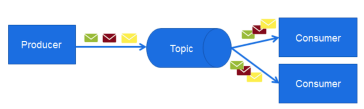

# Einführung in Messaging Systeme (Berle, 2017)

Die Herausforderung der Eingangs beschrieben Entwicklung, ist eine reibungslose Kommunikation der unterschiedlichen Services und Systeme. Im Folgenden wird nun näher auf den Austausch von Informationen und deren Probleme eingegangen, die beim Senden bzw. beim Empfangen von Nachrichten auftreten.

1. System A möchte System B eine Nachricht senden.
System B ist aber nicht erreichbar aufgrund von Netzwerk-
Problemen. System A hat aber keine Möglichkeit um die Nachrichten solange vorzuhalten bis die Netzwerkprobleme behoben sind.

2. System A sendet unmengen an Nachrichten an System B,
wobei der Empfänger so viele Nachrichten auf einmal nicht
verarbeiten kann und überlastet ist.

Um diese Herausforderungen zu lösen, werden Messaging-Systeme in Form von Queues oder Topics dazwischen geschaltet.

### Messaging Systeme

Eine Queue hält die gesendeten Nachrichten solange vor, bis der Empfänger die Nachricht verarbeiten kann. Danach kann die Nachricht aus der Warteschlange gelöscht werden.

Die zweite Messaging Variante ist der Publish-Subscribe-Mechanismus, welcher die Nachrichten an alle Empfänger verteilt. Zum Beispiel, alle die ein RSS-Feed abonniert haben bekommen die Nachricht zugesendet.

