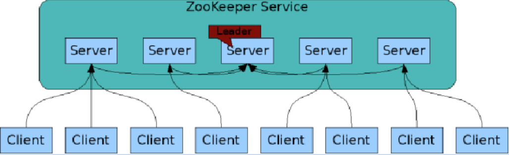
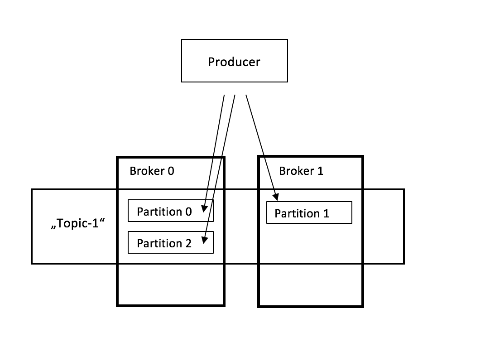
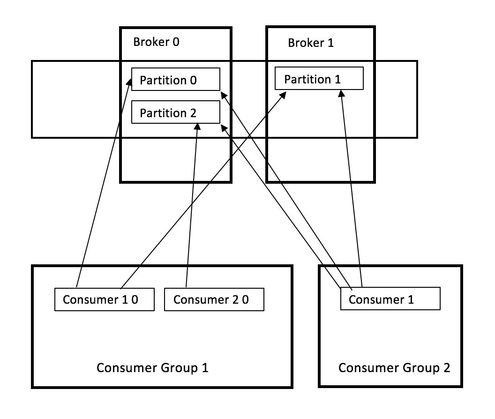

# Einführung in Kafka

Im nachfolgenden Kapitel wird die Architektur und die Bestandteile von Kafka beschrieben. Kafka verwendet - wie bereits im vorherigem Kapitel beschrieben - den Publish-Subscribe Mechanismus. Nach einer kurzen Erklärung der unterschiedlichen Bestandteile von Kafka, wird zunächst die Veröffentlichung der Nachrichten vom Producer genauer erläutert und anschließend das Lesen der Nachrichten aus den Topics. Für jedes Topic in einem Kafka Cluster existieren mehrere Broker, welche in Partitionen aufgeteilt sind. So gibt es für ein Topic mehrere Broker, welche wiederum in mehrere Partitionen aufgeteilt sind. Dadurch wird die Last in einem Topic verteilt. Voraussetzung ist hierbei der Betrieb eines Apache Zookeepers, welcher die Verteilung der Broker im Cluster übernimmt. Damit, wie später erläutert wird, eine Semantik wie „Excactly once“ möglich ist, müssen alle Teile zusammenarbeiten.

## Zookeeper (UiO University Oslo, 2013)

Der Zookeeper ist ein zentraler Service um Verteilte Systeme  realisieren zu können. Zu den Aufgaben gehören Konfiguration, Namensgebung, Locks und Sychonisation sowie Group-Services. Einfach ausgedrückt ist der Zookeeper ein Koordinator für verteilte Applikationen, damit die Zusammenarbeit von mehreren Knoten funktioniert. Der Zookeeper-Service enthält eine Anzahl von Servern, welche eine Kopie der Daten im Speicher halten. Ein Server wird beim Start als Leiter gewählt. Die Clients verbinden sich immer nur zu einem Zookeper Server und es wird je Client nur eine Netzwerkverbindung verwendet. Lesen können die Clients von jedem Server, nur schreiben können Sie nur über den Lead-Server.

## Broker (Johansson, 2016)

Ein Kafka Cluster besteht aus mindestens einem Server - dem Broker - in welchem Kafka läuft. Ein Producer sendet Nachrichten zu einem Kafka Topic innerhalb eines Brokers. Dort können die Daten anschließend von Consumern gelesen werden.

## Producer (Apache Kafka, kein Datum)

Ein Producer veröffentlicht Nachrichten in einer Partition in einem Topic ihrer Wahl. Die Auswahl des Topics kann dabei durch die Round Robin Methode passieren um die Last zu verteilen, oder durch einen Key in der Nachricht.

## Topic (Johansson, 2016)

In einem Topic werden Nachrichten gespeichert und anschließend wieder gelesen. Der Producer schreibt die Nachricht in ein spezifisches Topic und der Consumer liest aus diesem die Nachrichten wieder aus. Ein Topic kann meherer Partitionen beinhalten.

## Consumer (Johansson, 2016)

Consumer lesen die Nachrichten von einer Partition innerhalb eines Topics. Consumer können auch einer Consumer-Gruppe beitreten. Jeder dieser Gruppen liest von einem set an Partionen die Nachrichten die dort von den Producern reingeschrieben werden. Es werden die Nachrichten nur von einem Consumer innerhalb einer Consumer-Gruppe gelesen. Dadurch können Nachrichten parallel gelesen werden, wodurch ein hoher Lesedurchsatz möglich ist.  

## Connector (Apache Kafka, kein Datum)

Die Connector API erlaubt die Wiederverwendbarkeit von Producern und Consumern welche Kafka-Topics zu Applikationen verbindet. Durch die Connector API können ständige Pulls von Datensystemen zu Kafka durchgeführt werden.

# Zusammenspiel der einzelnen Komponenten (Troßbach, 2017)

## Vom Producer zum Topic
Die Nachrichten vom Producer werden nun in einer Partition in einem Broker in einem sogenannten Commit Log vorgehalten. Die Nachrichten werden in die Partitionen in der Reihenfolge in der sie geschrieben angehängt und erhalten einen Offset. Der Offset beginnt mit 0 für die jeweilige Partition. Eine eindeutige Identifikation einer Nachricht wird mit dem Tupel - Topic, Partition und Offset - erreicht.  
Die Quittierung der Nachrichten ist ein wichtiger Aspekt um zu gewährleisten, dass die Nachrichten im Kafka-Cluster korrekt angekommen sind. Der Producer entscheidet welches Quittierungsverfahren verwendet wird. Entweder wird keine Quittung von Cluster an den Producer zurückgesendet, damit kann man aber nie wissen ob die Nachrichten angekommen sind. Eine andere Konfigurationsmöglichkeit ist, dass der Broker der Partition die Quittung vornimmt oder der Broker und die Replikas der Partition.
Die RAM Auslastung eines Brokers ist relativ gering, so dass  der Rest der Speicherkapazität für das Cachen der Daten verwendet werden kann. Sofern diese nicht von anderen Prozessen verwendet werden, können die Daten sofort dem Consumer zur Verfügung gestellt werden. Aus diesem Page Cache können die Daten dann sofort über Netzwerk Sockets geschrieben werden, ohne dass hierbei neue Objekte erzeugt werden müssen.

### Replikas (Garg, 2013)

In diesem Abschnitt wird auf ein wichtiges Feature in Kafka eingegangen, die Replikationen. Kafka steht für hohe Skalierbarkeit, hohe Verfügbarkeit und zuverlässige Lieferung der Nachrichten, auch wenn Broker ausfallen sollten. Jede Partition hat n Replikationen, wodurch die Lieferung der Nachrichten Garantiert werden kann, wenn die nicht Verfügbarkeit kleiner n-1 ist. Bei vier Replikationen können also bis zu drei  ausfallen, um die Nachricht zu liefern. Pro Partition wird immer eine Lead-Replika definiert, welche Informationen über die Liste der restlichen Replikas in der Partition besitzt die mit der Lead Replikation synchronisiert sind. Wenn ein Lead Replika ihre Empfangsbestätigung (ACK) dem Producer nicht sendet, also entweder der Schreibvorgang fehlschlägt oder das senden der Empfangsbestätigung nicht ankommt, sendet der Producer die Nachricht erneut zu einem neuen Lead Broker. Die Auswahl des Lead Brokers geschieht indem alle Replikationen sich dem Zookeeper zurückmelden müssen. Der erste Broker der sich zurückmeldet wird zum Lead befördert. In Kafka werden zwei Replikationsmodi angeboten:

### Synchrone Replikation
Zunächst findet der Producer die Lead Replika vom Zookeeper heraus und veröffentlicht die Nachricht. Danach wird die Nachricht ins Log der Lead Replika geschrieben. Dann holen die Replikas die Nachricht durch einen Kanal, wodurch die korrekte Reihenfolge der Nachrichten sichergestellt wird. Wenn alle Replikationen die Nachrichten im Log haben, senden diese eine Benachrichtigung (ACK) zur Lead Replika. Wenn diese alle ACKs bekommen haben, sendet Sie ihre Bestätigung zum Producer.

### Asynchrone Replikation

Hier kann die Definition zur Synchronen Replikation übernommen werden. Mit dem Unterschied, dass die Lead-Replika nicht auf die Bestätigungen der „Follower“ wartet, sondern ihre ACK sofort zum Producer zurückschickt. Bei dieser Methode kann die korrekte Lieferung der Nachricht nicht gewährleistet werden, da die Aufnahme der Nachricht der Replikas Fehlschlagen kann.

## Vom Topic zum Consumer
Im folgenden Abschnitt wird beschrieben, wie die soeben in das Kafka Cluster geschriebene Nachrichten von den Consumern gelesen werden können.  
Die Nachrichten werden mit einem Key-Value paar definiert. Der Producer entscheidet dabei in welche Partition er die Nachricht schreibt. Standardmäßig geschieht dies anhand des Hash-Wertes, wobei sichergestellt wird, das gleiche Keys in die gleiche Partition geschrieben werden. Wird kein Schlüssel vergeben, wird die Verteilung der Nachrichten nach dem Round Robin Verfahren verteilt. Die Consumer werden in Consumer Gruppen aufgeteilt, welche die Topics abonnieren, die sie empfangen möchten. Bei einem Consumer in der Gruppe, liest der Consumer alle abonnierten Partitionen im Topic ein. Sind mehrere Consumer in einer Gruppe, werden die Partitionen des Topics auf die Consumer aufgeteilt. Dies geschieht dynamisch, somit können beliebig neue Consumer hinzugenommen und entfernt werden. Die Partitionen werden automatisch auf die Consumer verteilt bzw. umverteilt. Jede Partition ist einem Consumer innerhalb einer Gruppe zugewiesen. Somit ist sichergestellt, dass alle Nachrichten pro Consumer Gruppe gelesen werden. Da die Nachrichten von den Consumer gelesen werden und nicht von den Brokern abgeschickt werden, wird eine Überlastung der Consumer vermieden, da diese nur Daten holen, wenn Sie diese auch verarbeiten können.

