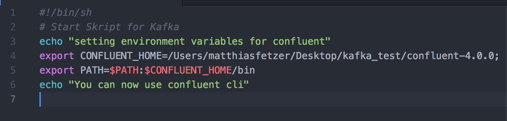
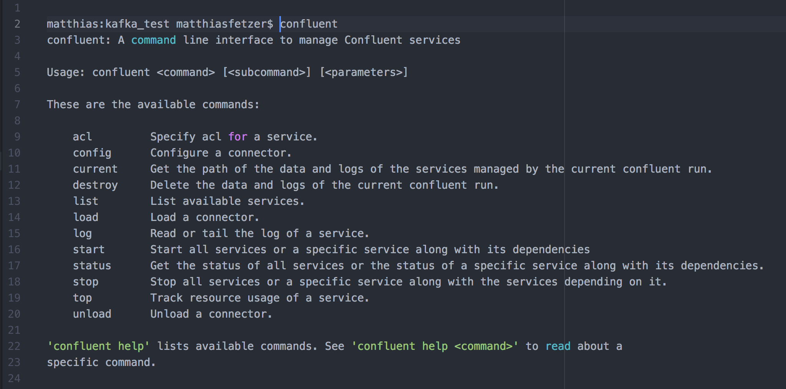
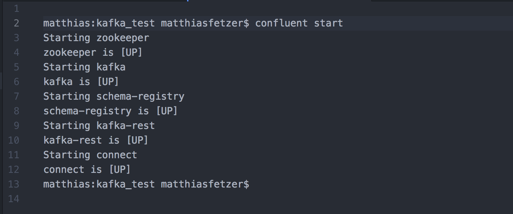
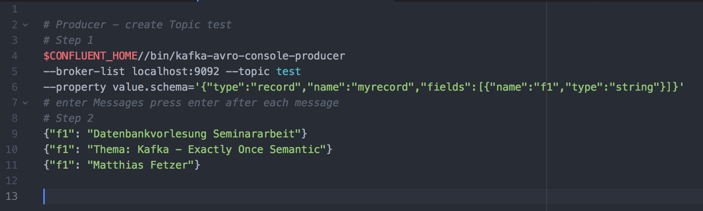
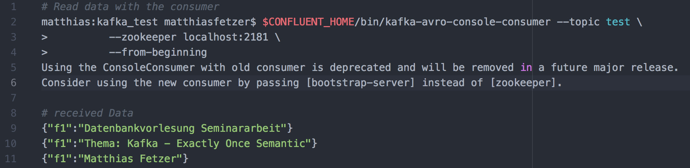

# Anwendungsbeispiel (confluent, 2018)

In diesem Kapitel wird ein Praxisbeispiel gegeben, wie in Kafka Nachrichten von einem Producer an ein Topic geschickt werden können und dort von einem Consumer gelesen werden. Das starten der benötigten Server Instanzen wurde hier mit dem Confluent Cli durchgeführt. Es werden dann drei Nachrichten (Datenbankvorlesung Seminararbeit, Thema: Kafka –Exaclty Once Semantik, Matthias Fetzer) an ein Topic mit dem Namen "Test" geschickt und von dort gelesen.

Für das Beispiel wurde die Confluent Kafka Version 4.0.0 verwendet. Dazu muss einfach die Bibliothek von folgendem Link heruntergeladen werden:

<a href="https://www.confluent.io/download/" target="_blank">download Confluent</a>

Es werden verschiedene Download Formate angeboten. Hier einfach das am besten passende auswählen. Für ein Unix System eignet sich das tar.gz Format gut.

In der Version 4.0.0 gibt es ein Confluent Command Line Interface (cli), welches den Umgang erleichtert, im speziellen um die Server Instanzen zu starten. Es müssen nicht mehr alle Instanzen mit ihren zugehörigen Properties Dateien für den Start eingegeben werden.  Um nicht immer zu dem Pfad springen zu müssen, wird zunächst ein Script gestartet, welches den Pfad zum Confluent cli in die Umgebungsvariable setzt. Im nachfolgender Abbildung der Inhalt:

Für die Verwendung einfach den Inhalt in eine Textdatei schreiben und mit der Endung ".sh" versehen.
Wichtig ist hierbei, dass ein Punkt beim starten des Skripts verwendet wird, da die Umgebungsvariablen im Parent Prozess gesetzt werden. Im nachfolgenden eine Übersicht über die Befehle welches das CLI mit sich bringt. Bei einem Windows Betriebssystem müssen die entsprechenden Befehle, um die Umgebungsvariablen zu setzen, herausgesucht werden und in ein entsprechendes windows shell skript eingeben werden. Auf dies wird an dieser Stelle nicht weiter eingegangen, da dies relativ trivial ist und im Internet dazu einige Informationen gefunden werden können. Im nachfolgenden eine Übersicht der Confluent Befehle:   

Als sehr nützlich ist der „status“- Befehl. Dieser zeigt an, welche Instanzen gestartet sind.
Als nächsten starten wir nun die Kafka Instanzen. Dort enthalten ist auch der „zookeeper“, welcher für Kafka notwendig ist. Dieser wurde Bereits in den vorherigen Kapiteln beschrieben. Zum Starten nun einfach den Befehl „confluent start“ eingeben. Das Ergebnis sollte wie folgt aussehen:

Wie man in der Abbildung sehen kann, sind alle Instanzen gestartet. Als nächstes muss nun ein Producer gestartet werden. Dies kann der Einfachheit halber mit der $CONFLUENT_HOME variable gemacht werden, welche vorher im Skript gesetzt wurde. Das Topic hat den Namen „test“. Dann werden Nachrichten erstellt, welche direkt mit „enter“ gesendet werden. Der Prozess kann dann beendet werden. In folgender Abbildung die auszuführenden Schritte in der Console:

Die drei Nachrichten wurden nun vom Producer ins Topic „test“ geschrieben. Im Folgenden werden nun die Nachrichten vom Producer gelesen. Alle Nachrichten, welche zuvor vom Producer ins Topic „test“ geschrieben worden sind, können nun gelesen werden.

