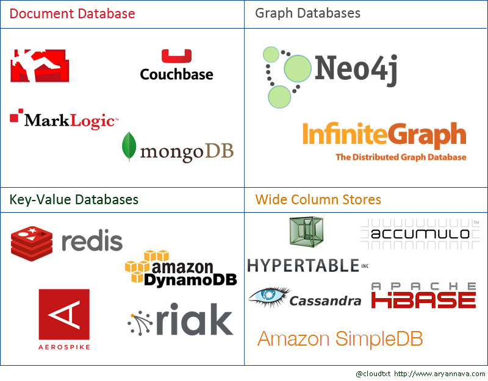

# 1 Einleitung

Ein Umdenken bei der Verwendung von relationalen Datenbanken erfolgte durch den "Wandel in der Informations- und Kommunikationsverarbeitung [...] zu Beginn des 21. Jahrhunderts und betraf "zunächst führende Internetunternehmen wie Google, [...] und Yahoo sowie soziale Netzwerke wie Facebook, LinkedIn und Twitter. Vor allem die diesen Webseiten zugrunde liegenden Datenbanken, deren Markt bereits seit Jahrzehnten von relationalen Datenbanken dominiert wird, wurden infolge der teilweise extremen Anforderungen an ihre Belastungsgrenzen geführt." (Hecht, S.4)

"Auch Amazon sah sich zu diesem Zeitpunkt mit ähnlichen Herausforderungen
konfrontiert. Viele unternehmenskritische Dienste und Daten des Onlineshops, wie
Bestsellerlisten, Einkaufswagen, Benutzervorlieben, Verkaufszahlen und Produktkataloge, mussten innerhalb riesiger Cluster verteilt werden. Da auch nur kurzzeitig Ausfälle dieser Dienste massive finanzielle Schäden nach sich ziehen würden, stand vor allem die Hochverfügbarkeit dieser Dienste im Fokus des Interesses von Amazon."  (Hecht, S.5)

Da sich "traditionelle Datenbankenlösungen" in der modernen Entwicklung von webbasierten Anwendungen zunehmend als "ineffizient erwiesen", entwickelten viele Internet-Giganten aus dieser Not neue, hochverfügbare und nichtrelationale Datenbank-Lösungen. (Hecht, S.5)

Johan Oskarsson und Eric Evans führten erstmals 2009 den Begriff "NoSQL" für verteilte, nichtrelationale Datenbanksysteme ein (Hecht, S.5). Laut Hecht (Abstract) versprechen "NoSQL-Datenbanken [...] eine flexible Datenmodellierung, eine hohe Verarbeitungsgeschwindigkeit sowie eine lineare Skalierbarkeit [...] ".

Besonders bei "der Entwicklung von interaktiven Web-Anwendungen sind NoSQL-Datenbanksysteme zunehmend beliebt", da sie die Nutzung von "flexible[n] Datenmodelle[n]" erlauben. "Das erleichtert insbesondere ein agiles Projektmanagement, das sich durch häufige Releases und entsprechend häufige Änderungen am Datenmodell auszeichnet" (Klettke et al., Abstract). Zudem genügt "die Nutzung einer einzigen Datenbanktechnologie, z.B. der relationalen", bei vielen modernen "webbasierte Anwendungen" nicht mehr (Meier und Kaufmann, Abstract).

Laut Hecht (S.6) haben NoSQL-Datenbanken, aufgrund der "gestiegenen Anforderungen von Informations- und Kommunikationssystemen des 21. Jahrhunderts", folgende Eigenschaften:

1. Kein relationales Datenmodell
2. Schwache Schemarestriktionen
3. Kein ACID-Transaktionsmodell
4. Einfache Datenreplikation
5. Horizontale Skalierbarkeit

"Unter dem Begriff NoSQL (Not only SQL) werden alle Datenbanken zusammengefasst,
die nicht dem relationalen Modell folgen. Dadurch ergibt sich
eine Sammlung sehr heterogener Lösungen" (Herden et al., S.337). Laut Herden et al. (S.337-338) werden in der Literatur üblicherweise folgende Kategorien unterschieden:

* Schlüssel-Wert-basierte Datenbanken (Key-Value)
* Wide Column Stores 
* Dokumentenorientierte DB-Systeme
* Graphdatenbanken

Bei Key-Value Datenbanken "wird unter einem eindeutigen Schlüssel ein einzelner Wert gespeichert, wobei prinzipiell die Struktur des Wertes von der Datenbank nicht interpretiert wird. Einige Lösungen weichen hiervon ab und bieten z.B. das Speichern von Listen und Mengen (Redis) oder die Gruppierung von Schlüssel-Wert-Paaren zu Domänen (Amazon Simple DB). Großer Pluspunkt der Schlüssel-Wert-basierten Systeme ist die einfache Verteilung großer Datenmengen auf mehrere Rechner. Demgegenüber wird die Strukturierung von Daten jedoch vernachlässigt." (Herden et al., S.337-338)

"Wide Column Stores basieren auf Tabellen und bieten die Möglichkeit in einer
Zeile mehrere Attribute zu speichern. Attributname und –wert bilden ein
Schlüssel-Wert-Paar, das als Spalte bezeichnet wird. Wesentlicher Unterschied
zu relationalen Tabellen ist die Nicht-Existenz eines Schemas, d.h. zu einer
Zeile können beliebige Daten hinzugefügt bzw. weggelassen werden. Daraus
ergibt sich auch das primäre Anwendungsgebiet von dünn besetzten Daten." (Herden et al., S.337-338)

"In dokumentenorientierten DB-Systemen werden die Daten in Form semistrukturierter
Dokumente gespeichert, wobei Dokumente mithilfe eines
Schlüssels gespeichert und geladen werden. Abfragen nach Dokumenten mit
bestimmten Bestandteilen sind möglich. Anwendungsgebiet sind (semi)strukturierte
Inhalte, die Skalierbarkeit hingegen ist gegenüber den beiden
ersten vorgestellten Ansätzen geringer." (Herden et al., S.337-338)

Graphdatenbanken sind auf das Speichern und effiziente Traversieren von
Graphen ausgelegt (Herden et al., S.337-338). Dieser Datenbanktyp organisiert "Objekte in Knoten und Beziehungen zwischen Objekten in Kanten" (Meier und Kaufmann, Abstract).

In der nachfolgenden Grafik sind einige Vertreter der vier NoSQL-Datenbank Kategorien abgebildet:

*Abbildung 1: Übersicht der vier NoSQL-Datenbank Kategorien 
(https://aryannava.files.wordpress.com/2014/04/nosql-database-family.jpg)*
