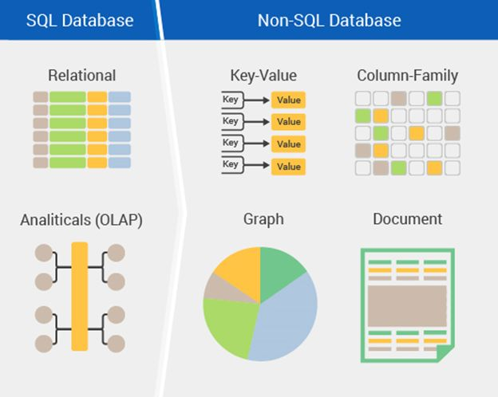

# 1 Einleitung

## Hecht

- NoSQL-Datenbanken versprechen eine flexible Datenmodellierung, eine hohe Verarbeitungsgeschwindigkeit
sowie eine lineare Skalierbarkeit und sind daher Mittelpunkt
eines derzeit anhaltenden Hypes um das Thema Big Data (Hecht, 2015, Abstract)

- Der Wandel in der Informations- und Kommunikationsverarbeitung, der durch den
Begriff Big Data beschrieben wird, betraf zu Beginn des 21. Jahrhunderts zunächst
führende Internetunternehmen wie Google, Amazon und Yahoo sowie soziale Netzwerke
wie Facebook, LinkedIn und Twitter. Vor allem die diesen Webseiten zugrunde
liegenden Datenbanken, deren Markt bereits seit Jahrzehnten von relationalen Datenbanken
dominiert wird, wurden infolge der teilweise extremen Anforderungen an
ihre Belastungsgrenzen geführt. (Hecht, 2015, S.4)

- Auch Amazon sah sich zu diesem Zeitpunkt mit ähnlichen Herausforderungen
konfrontiert. Viele unternehmenskritische Dienste und Daten des Onlineshops, wie
Bestsellerlisten, Einkaufswagen, Benutzervorlieben, Verkaufszahlen und Produktkataloge,
mussten innerhalb riesiger Cluster verteilt werden. Da auch nur kurzzeitige
Ausfälle dieser Dienste massive finanzielle Schäden nach sich ziehen würden, stand
vor allem die Hochverfügbarkeit dieser Dienste im Fokus des Interesses von Amazon.
Weil sich traditionelle Datenbankenlösungen auch hier als ineffizient erwiesen, entwickelte
Amazon den hochverfügbaren Key Value Store Dynamo [45] und stellte dessen
Konzept im Jahr 2007 vor. (Hecht, 2015, S.5)

- Aufgrund der steigenden Anforderungen an Informationsund
Kommunikationssysteme erhalten diese Datenbanken in zunehmendem Maße
auch außerhalb von führenden Internetunternehmen eine erhöhte Aufmerksamkeit,
weshalb sich inzwischen der von Johan Oskarsson und Eric Evans im Jahr 2009 eingeführte Begriff „NoSQL“ [153] für diese verteilten, nichtrelationalen Datenbanksysteme etabliert hat. (Hecht, 2015, S.5)

- Innerhalb der NoSQL-Bewegung wird die Verwendung relationaler Datenbanken als
Allzweckwerkzeug („One size fits all“ [164]) in der Datenhaltung kritisiert. Ob Apps
für Smartphones, Web- und Desktopapplikationen, eingebettete Systeme oder Data
Warehouse Systeme, relationale Datenbanken dominieren sämtliche Anwendungsfälle
in allen IT-Bereichen der heutigen Zeit. Selbst wenn in bestimmten Anwendungsfällen
keine relationalen Daten vorliegen, wird häufig viel Zeit und Energie investiert, um
diese Daten mithilfe nicht selten komplexer Transformationen auf das relationale Datenmodell
abzubilden. Nach der Philosophie der NoSQL-Bewegung sollten Softwareentwickler in solchen Fällen alternative Datenbankmodelle in Betracht ziehen, die unter
Umständen besser zu den Daten und Anforderungen der jeweiligen Anwendungen
passen („Use the right tool for the job“). Dieses Umdenken kann dazu führen, dass
eine einzige Anwendung verschiedene Datenbanksysteme einsetzt, die jeweils spezifische
Teilanforderungen der Applikation abdecken. In diesem als Polyglot Persistence
bezeichneten Ansatz ist es durchaus üblich, dass parallel zu NoSQL-Datenbanken
auch relationale Systeme eingesetzt werden, weshalb der Begriff „NoSQL“ inzwischen
als „Not Only SQL“ interpretiert wird. Diese Interpretation hebt das Potenzial von
NoSQL-Datenbanken als Ergänzung zu relationalen Datenbanken in bestimmten Anwendungsfällen
hervor und beschreibt somit strenggenommen nicht einzelne Datenbanksysteme,
sondern vielmehr die Systemarchitektur, in der diese Datenbanken eingesetzt
werden [153]. (Hecht, 2015, S.5-6)

- Kombiniert man die am häufigsten zitierte Definition des NoSQL-Archivs [50] mit der
gegenwärtig verfügbaren Fachliteratur [28, 153], ergeben sich in folgenden Kernpunkten
Übereinstimmungen: 1. Kein relationales Datenmodell, 2. Schwache Schemarestriktionen, 3. Kein ACID-Transaktionsmodell, 4. Einfache Datenreplikation, 5. Horizontale Skalierbarkeit.
Diese fünf Eigenschaften zielen auf die gestiegenen Anforderungen von Informationsund
Kommunikationssystemen des 21. Jahrhunderts ab [153]. (Hecht, 2015, S.6)

## Meier und Kaufmann

- Viele webbasierte Anwendungen setzen für die unterschiedlichen Dienste adäquate Datenhaltungssysteme ein. Die Nutzung einer einzigen Datenbanktechnologie, z.B. der relationalen, genügt nicht mehr. Key Value Stores sind einfach-strukturierte NoSQL-Datenbanksysteme, die sämtliche Daten in der Form von Schlüssel-Wertpaaren speichern. Werden die Merkmale einer Tabelle spaltenweise und nicht zeilenweise organisiert, erhðlt man die Spalten-Datenbanken, die sich zu Spaltenfamilien-Systemen erweitern lassen. Neben den Dokument- und XML-Datenbanken organisieren die Graphdatenbanken Objekte in Knoten und Beziehungen zwischen Objekten in Kanten. (Meier und Kaufmann, 2016, Abstract)

## Klettke et al.

- In der Entwicklung von interaktiven Web-Anwendungen sind NoSQL-Datenbanksysteme zunehmend beliebt, nicht zuletzt, weil sie flexible Datenmodelle erlauben. Das erleichtert insbesondere ein agiles Projektmanagement, das sich durch häufige Releases und entsprechend häufige Änderungen am Datenmodell auszeichnet. In diesem Artikel geben wir einen Überblick über die besonderen Herausforderungen der agilen Anwendungsentwicklung gegen schemalose NoSQL-Datenbanksysteme. Wir stellen Strategien für die Schema-Evolution aus der Praxis vor, und postulieren unsere Vision einer eigenen Schema-Management-Komponente für NoSQL-Datenbanksysteme, die für eine kontinuierliche und systematische Schema-Evolution ausgelegt ist. (Klettke et al., 2014, Abstract)

## Herden et al.

- Unter dem Begriff NoSQL (Not only SQL) werden alle Datenbanken zusammengefasst,
die nicht dem relationalen Modell folgen [EF+10, Ti11a, RW12]. Dadurch ergibt sich
eine Sammlung sehr heterogener Lösungen. In der Literatur [EF+10] werden
üblicherweise folgende Kategorien unterschieden:

- Schlüssel-Wert-(Key-Value-)basierte Datenbanken: Bei diesen Datenbanken
wird unter einem eindeutigen Schlüssel ein einzelner Wert gespeichert, wobei
prinzipiell die Struktur des Wertes von der Datenbank nicht interpretiert wird.
Einige Lösungen weichen hiervon ab und bieten z.B. das Speichern von Listen
und Mengen (Redis) oder die Gruppierung von Schlüssel-Wert-Paaren zu
Domänen (Amazon Simple DB).
Großer Pluspunkt der Schlüssel-Wert-basierten Systeme ist die einfache
Verteilung großer Datenmengen auf mehrere Rechner. Demgegenüber wird die
Strukturierung von Daten jedoch vernachlässigt.
Bekannte Vertreter dieser Kategorie sind Amazon Simple DB [Am12],
Chordless [Ch12], Riak [Ri12] und Redis [Re12].

- Wide Column Stores basieren auf Tabellen und bieten die Möglichkeit in einer
Zeile mehrere Attribute zu speichern. Attributname und –wert bilden ein
Schlüssel-Wert-Paar, das als Spalte bezeichnet wird. Wesentlicher Unterschied
zu relationalen Tabellen ist die Nicht-Existenz eines Schemas, d.h. zu einer
Zeile können beliebige Daten hinzugefügt bzw. weggelassen werden. Daraus
ergibt sich auch das primäre Anwendungsgebiet von dünn besetzten Daten. In
diese Kategorie fallen u.a. die Systeme Google BigTable [CD+06], Apache
Cassandra [He10, Ca12], Apache HBase [Ge11, Hb12] und Hypertable [Hy12].
337

- In dokumentenorientierten DB-Systemen werden die Daten in Form semistrukturierter
Dokumente gespeichert, wobei Dokumente mithilfe eines
Schlüssels gespeichert und geladen werden. Abfragen nach Dokumenten mit
bestimmten Bestandteilen sind möglich. Anwendungsgebiet sind (semi)strukturierte
Inhalte, die Skalierbarkeit hingegen ist gegenüber den beiden
ersten vorgestellten Ansätzen geringer. Die beiden Hauptvertreter dieser
Kategorie sind CouchDB [ALS10, WK11, Co12] und MongoDB [CD10, Ba11,
Mo12].

- Graphdatenbanken sind auf das Speichern und effiziente Traversieren von
Graphen ausgelegt. 

=> (Herden et al., 2012, S.337-338)

## Images

Quelle: https://aryannava.files.wordpress.com/2014/04/nosql-database-family.jpg

Quelle: http://csharpcorner.mindcrackerinc.netdna-cdn.com/UploadFile/f0b2ed/introduction-of-nosql-database/Images/NoSQL%20database.jpg