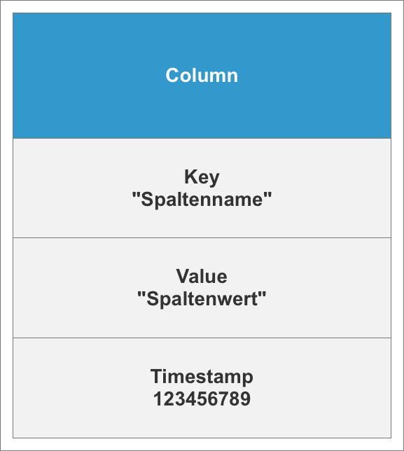
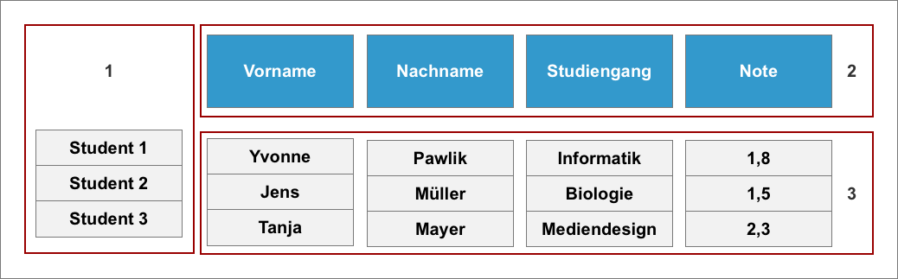
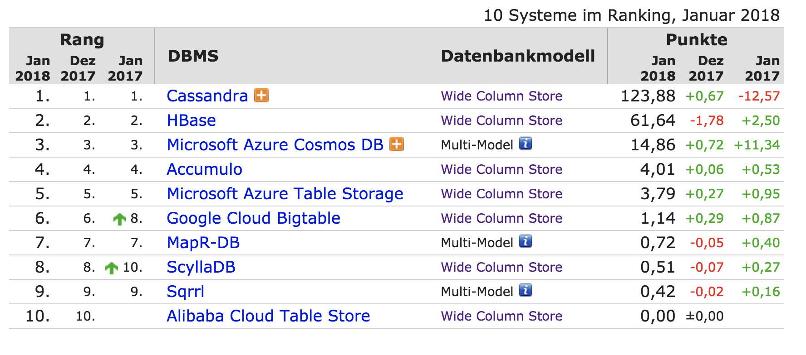
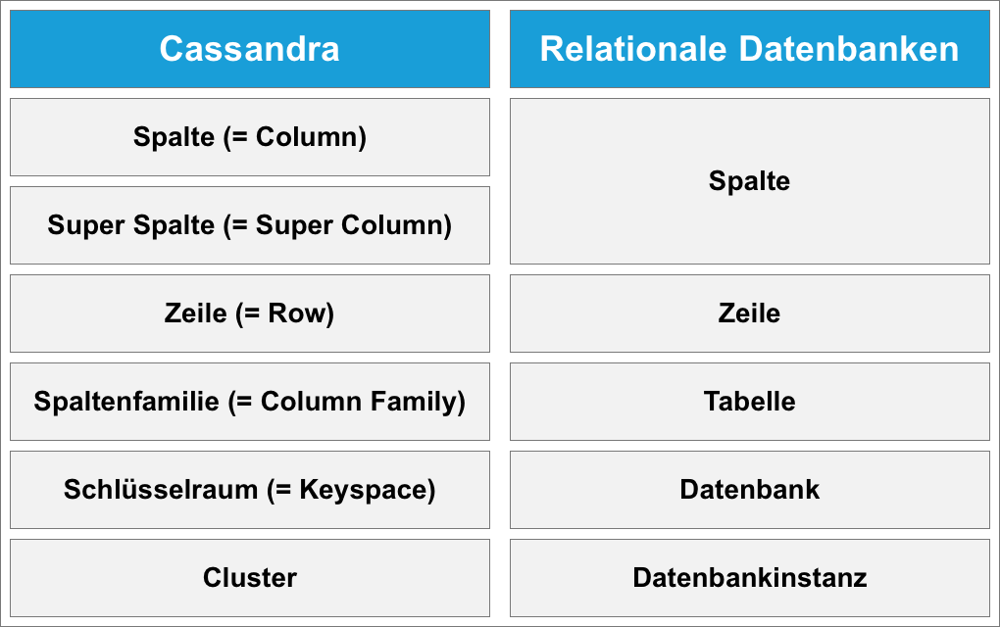
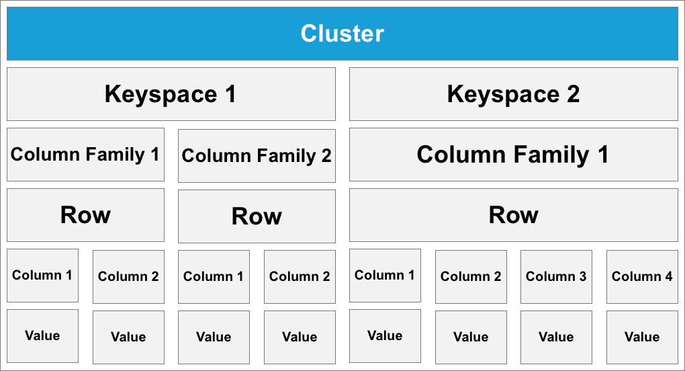
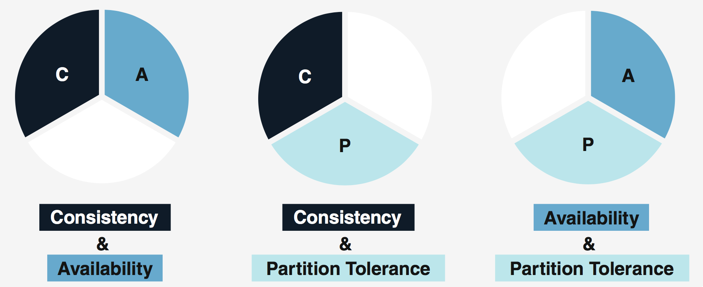
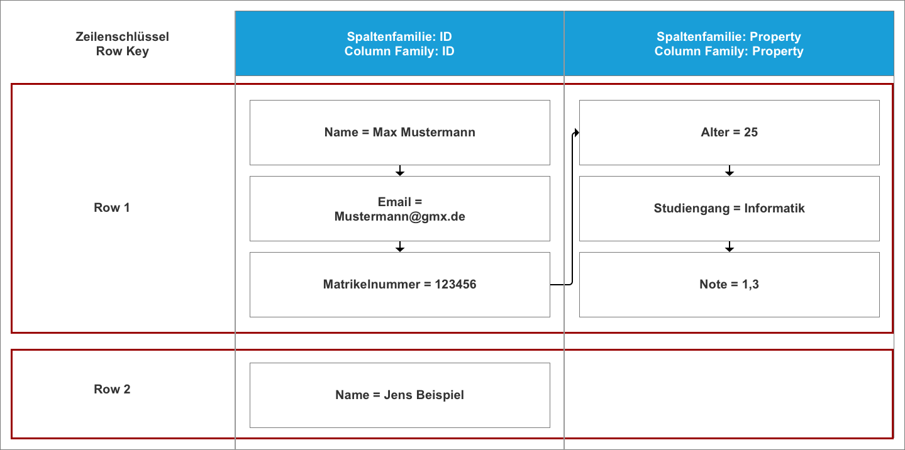

# 3 Spaltenorientierte Datenbanken

## 3.1 Allgemeines zu Wide Column Stores

In der NoSQL-Welt sind verschiedene Datenbankmodelle zu finden. Eines dieser Modelle bilden die sogenannten „Wide-Column Stores. Den Namen verdankt das Modell der Anzahl von bis zu 2 Milliarden Spalten die ein Datensatz aufnehmen kann. Häufig wird dieses Modell im deutschen mit dem Begriff „spaltenorientierte Datenbank“ übersetzt. Diese Übersetzung ist jedoch nur bedingt richtig, da er eigentlich für die relationalen Datenbanksysteme verwendet wird. Daher wird im Laufe dieser Ausarbeitung nur der englische Begriff verwendet.

Das Datenmodell der „Wide Column Stores“ unterscheidet sich von den traditionellen, relationalen Datenbanken. Sie sind tabellenähnlich aufgebaut, stellen eine Art zweidimensionale Variante des Key-Value Konzeptes dar und basieren im Grunde auf das BigTable Modell von Google (Chang et. al., 2006). In beiden Modellen existieren die Begriffe Zeile (= Row) und Spalte (= Column). Trotz einer ähnlichen Bedeutung sind sie mit anderen Eigenschaften belegt. Eine Zeile wird mit Hilfe eines Schlüssels identifiziert. Aus diesem Grund ist es möglich, dass mehrere Zeilen eine unterschiedliche Anzahl von Spalten besitzen können. Aufgrund dieser Eigenschaft, eignet sich das Modell besonders für analytische Aufgaben. Die Daten bei diesem Modell werden über Schlüssel gespeichert, die mit Werten verknüpft sind. Eine Spalte bildet dabei die kleinste Einheit. Sie besteht immer aus einem Key-Value Paar, sprich einen Namen der mit einem Wert verknüpft ist, sowie aus einem Zeitstempel, welcher rein der Versionsverwaltung dient. Man spricht hierbei von einer Spaltenstruktur und ist in Abbildung 1 grafisch dargestellt.

*Abbildung 1: Spaltenstruktur, eigene Darstellung*

Weisen Spalten einen ähnlichen Wert auf oder soll gemeinsam auf diese zugegriffen werden, werden sie zu sogenannten Spaltenfamilien (= Column Families) zusammengefasst. Diese bilden die Grundeinheit der Zugriffskontrolle und Speicherverwaltung (Chang et. al., 2006).
Es hat sich herausgestellt, dass seltener alle Spalten für eine Zeile benötigt werden, es allerdings Gruppen von Spalten gibt die häufig zusammen ausgelesen werden. Aus diesem Anlass ist es sinnvoll die Daten in Form von Spaltenfamilien zu organisieren. Des Weiteren wird dadurch der Zugriff optimiert. Daten können jedoch erst dann gespeichert werden, wenn entsprechende Spaltenfamilien angelegt wurden. Jede Spalte muss dabei einer Spaltenfamilie zugeordnet sein. Erst im Anschluss ist der Zugriff auf den Spaltenschlüssel möglich.

Datenobjekte werden mit einem Zeilenschlüssel und Objekteigenschaften mit einem Spaltenschlüssel adressiert. In Abbildung 2 ist der Aufbau einer Spaltenfamilie zu finden.
(1 = Zeilen-Schlüssel, 2= Spalten-Schlüssel, 3 = Spalten-Wert). Spaltenfamilien wiederum können in einem Keyspace zusammengetragen werden (Meier & Kaufmann, 2016).

*Abbildung 2: Spaltenfamilie, eigene Darstellung*

Die Verwendung von „Wide Column Stores“ bietet eine Vielzahl von Vorteilen. Sie zeichnen sich durch eine hohe Skalierbarkeit aus, sowie einer hohen Verfügbarkeit durch eine massive Verteilung von Daten. Diese Art von Datenbank wurde für eine Verteilung in großen Clustern konzipiert um sehr große Datenmengen performant verarbeiten zu können. Auch ist ein flexibler Umgang mit unstrukturierten Daten gegeben. Aufgrund eines selektiven Zugriffs auf die nötigen bzw. gewünschten Daten, kommt es zu einer Beschleunigung des Lesezugriffs. Ebenso wirkt es sich positiv auf den Schreibprozess aus (WiWi, 2015). Als Nachteil lässt sich der Schreibprozess über mehrere Spalten nennen. Sollen in einer Studierendendatenbank beispielsweise Daten zu einer Person hinzugefügt werden (Matrikelnummer, Studiengang, Abschlussnote) muss auf mehrere Spalten (= Columns) zugegriffen werden. Dies verlangsamt den Schreibprozess. Auch ist dieses Modell nicht für Graph-Daten geeignet (Baumann, 2015).
Das Wide Column Store Modell entstand aus dem Bedürfnis heraus ein flexibles System mit hoher Perfomenz und Verfügbarkeit beim Umgang mit Daten im Petabyte-Bereich (= 1024 Terabyte) haben zu wollen, die auf tausende Cluster-Knoten verstreut sind. Verwendung findet dieses Datenmodell in den unterschiedlichsten Bereichen. Aufgrund der Beschaffenheit für analytische Aufgaben wird es unter anderen im Data-Mining Bereich genutzt. Basierend auf die Eigenschaft große Mengen an Daten bewältigen zu können, in Bezug auf die Schreib- und Leselast, eignet sich das Modell für den Einsatz bei Web 2.0 Seiten. Wichtige Vertreter sind Youtube, Google, Facebook und Twitter (DB_2014), (Lakshman & Malik, 2010).

Anwendung findet dieses Datenbankmodell auch bei Facebook. Dort ermöglicht es das Durchsuchen der Inbox. Auch ist es dem Modell aufgrund der Struktur möglich, Daten in Abhängig von der Zeit (Zeitstempel) zu erfassen. Weitere Anwendungsgebiete umfassen die Bereitstellung von Kartenmaterial von Google Earth, sowie Teile der Websuche (Chang et. al., 2006).

Auf der Website von DB-Engines (DB, 2018) ist eine Rangliste in Bezug auf die Popularität von Datenbankmanagementsystemen der letzten drei Monate zu finden. Im Bereich der Wide Column Store handelt es sich bei Apache Cassandra, Apache HBase und Microsoft Azure Cosmos DB um die populärsten Datenbanken, wie es in Abbildung 3 zu sehen ist.

*Abbildung 3: Ranking Wide Column Stores (DB_2)*

## 3.2 Cassandra

Bei Cassandra handelt es sich um die Wide Column Store Datenbank mit dem größten Ruhm. Neben einer Darstellung von allgemeinen Informationen zu dieser Datenbank, werden im weiteren Verlauf auch das Datenmodell, die Konsistenz bei massiv verteilten Daten sowie die Vor- und Nachteile näher betrachtet.

### 3.2.1 Allgemeines
Cassandra wurde 2008 von den Facebook Mitarbeitern Prashant Malik und Avinash Lakshman entwickelt. Motiviert wurde die Entwicklung durch das „Inbox Search“ Problem. Es wurde eine effiziente Speicherung der Nutzernachrichten anhand von Indizes, sowie eine performante Suche angestrebt. Dadurch sollte es dem Nutzer ermöglicht werden, die gesendeten bzw. erhaltenen Nachrichten nach gewünschten Begriffen durchsuchen zu können. Dies setzte eine hohe Verfügbarkeit und Skalierbarkeit voraus. Weshalb Cassandra auf hohe Schreib- und Leselasten optimiert wurde. 2008 wurde Cassandra dann als Open Source Projekt auf dem Markt veröffentlicht. Bereits 2009 wurde es dann in den Apache Incubator aufgenommen um später ein Teil des Leistungsangebotes der Apache Software Foundation (ASF) zu werden. Im Jahr 2010 wurde die Datenbank als Top-Level Projekt eingestuft und wird seitdem aktiv weiterentwickelt (M. Gassner).

Wie bei allen Wide Column Store Datenbanken, orientiert sich auch Cassandra an dem Datenmodell „BigTable“ von Google. Der Unterschied liegt hier jedoch in der hybriden Nutzung von Cassandra. Es verwendet sowohl Key-Value Eigenschaften als auch eine relativ flexible Schemaunterstützung. (Edlich et. al., 2010). Verwendet wird Cassandra aktuell von Internetunternehmen wie Netflix und Apple.

### 3.2.2 Datenmodell

Cassandra weist einige Ähnlichkeiten bei den Begriffen mit relationalen Datenbanken auf. Ein Vergleich dieser Begrifflichkeiten wird in Abbildung 4 aufgeführt. Aufgrund der Begrifflichkeiten (Spalte und Zeile) kann es passieren, dass diese Konstrukte falsch verstanden bzw. interpretiert werden. Dies ist besonders bei Personen der Fall, die den Umgang mit relationalen Datenbanken gewohnt sind.

*Abbildung 4: Vergleich Cassandra und rationale Datenbanken (Jansing & Ghadir, 2015)*

Um das Datenmodell vereinfacht darzustellen, kann von einem Containermodell ausgegangen werden. Hier würde ein Cluster einem Datenbankserver entsprechen. Dieser beherbergt wiederum mehrere Datenbanken (Schlüsselräume). Die Spaltenfamilien entsprechen somit einer Tabelle und besitzen Zeilen. Jede Zeile kann dabei eine beliebige Anzahl von Spalten besitzen. Und jede Spalte bildet ein Key-Value Paar (T. Delle). Es folgt eine Erläuterung der einzelnen Bestandteile des Datenmodells von Cassandra (Featherstone, 2010):

* **Spalte:** Eine Spalte bildet die kleine Informationseinheit die von Cassandra unterstützt wird. Ausgedrückt wird eine Spalte in Form von name : value. Im Gegensatz zu den relationalen Datenbanken können die Einträge je nach Zeile unterschiedlich sein.

* **Superspalte:** Superspalten weichen von der Name-Value Modell der normalen Spalten ab. Stattdessen wird der Wert durch ein Array von Spaltenfamilien repräsentiert und werden eingesetzt um Sammlungen von Strukturierten Informationen zu speichern.

* **Zeile:** Bei einer Zeile handelt es sich um eine eindeutig identifizierbare Einheit von Daten, die sich aus Spalten und Superspalten (= Super Columns) zusammensetzen. Jede Zeile ist dabei anhand ihres Schlüssels eindeutig identifizierbar.

* **Spaltenfamilie:** Bei der Spaltenfamilie handelt es sich um ein abstraktes Konstrukt. In Ihr werden die Zeilen gespeichert. Diese besitzen einen Schlüssel und verbinden Spalten und Superspalten als Element. Es existiert kein vorgegebenes Schema. Daher verbleibt das Wissen zur Interpretation der Daten auf Applikationsebene. Dies stellt einen starken Kontrast zu den relationalen Datenbanken dar, da es vordefinierte Namen und Typen für die Spalten in jeder Tabelle gibt. Spaltenname und Spaltenwert werden als Bytes mit unbestimmter größer Abgespeichert und normalerweise als UTF-8 Zeichenkette oder 64bit Integer Wert interpretiert. Eine Sortierung der Spalten innerhalb einer Spaltenfamilie erfolgt entweder nach einem UTF-8 codierten Wert, einem Zeitstempel (= timestamp), als long Interger oder einem Algorithmus. Des Weiteren kann individuell gewählt werden, ob die Spaltenfamilie anhand des Zeilenschlüssels sortiert werden soll oder nicht.

* **Schlüsselraum:** Bei einem Schlüsselraum handelt es sich um die oberste Ebene der Datenstruktur. Bei relationalen Datenbanken entspricht dieser Bereich der Datenbank Ebene (vgl. Abbildung 4). Schlüsselräume werden genutzt, um unterschiedliche Daten voneinander zu trennen.  Des Weiteren besitzen Schlüsselräume Metadaten, die das Verhalten des Raumes festlegen. Hierzu zählen der Replikationsfaktor (legt fest, auf wie viele Knoten im Raum gespeicherte Daten repliziert werden) und zum anderen die Platzierungsstrategie für Replikate (legt fest, wie viele Replikate auf unterschiedlichen Knoten verteilt werden) (Hewitt, 2011).

Es ist direkt erkennbar, dass das Datenmodell von Apache Cassandra von den eigentlichen „Wide Colum Stores“ abweicht (vgl. Abbildung 2). Eine grafische Darstellung des Cassandra Datenmodells ist in Abbildung 5 zu finden.

*Abbildung 5: Cassandra Datenmodell, eigene Darstellung*

### 3.2.3 Konsistenz

Bei umfangreichen und verteilten Datenbanksystemen sind eine hohe Verfügbarkeit und Ausfalltoleranz wichtig. Dies ist nur möglich, wenn im Bereich der Konsistenz Abstriche gemacht werden. Im Jahr 2000 wurde auf bei einem Symposium von Eric Brewer die Vermutung aufgestellt, dass verteilte Systeme nämlich nicht alle drei Eigenschaften gleichzeitig aufweisen können. Diese Vermutung wurde durch das MIT in Boston bewiesen und unter dem Begriff CAP-Theorem etabliert (Meier & Kaufmann, 2016).

*Abbildung 6: CAP-Theorem nach (Meier & Kaufmann, 2016)*

Wie der Abbildung zu entnehmen ist, kann ein verteiltes System immer nur 2 Eigenschaften aufweisen. Entweder verfügt das System über eine hohe Konsistenz mit Verfügbarkeit (CA), Konsistenz mit Fehlertoleranz (CP) oder über Verfügbarkeit mit Ausfalltoleranz (AP). Cassandra zählt hier zu den Systemen mit hoher Verfügbarkeit und Ausfalltoleranz (AP).

Um diese Eigenschaften zu gewährleisten verwendet Cassandra replizierte Rechnerknoten um die Daten über mehrere Knoten hinweg zu replizieren. In diesem Modell sind alle Knoten gleichberechtigt, wodurch es keine Masterknoten gibt. Auf wie vielen Knoten die Daten dabei gespeichert werden, hängt von dem Replikationsfaktor ab. Des Weiteren kann bei Abfragen ein Konsistenzlevel angegeben werden. Dieser gibt die Anzahl der zu lesenden Replikas an damit eine Anfrage erfolgreich ist. Diese Methode wird auch als „Tunable Consistency“ bezeichnet (Codecentric). Zwischen Folgenden Konsistenzlevel wird dabei unterschieden (Nidzwetzki,2013):

*Konsistenz-Level von Cassandra beim Lesen von Daten*

* **All:** Das Ausliefern der Zeilen erfolgt erst, wenn die Zeilen von allen Knoten vorliegen
* **One:** Dem Client wird das erste verfügbare Ergebnis zurückgegeben.
* **Quorum:** Haben (Replikationsfaktor R / 2 +1) Knoten geantwortet, werden die Zeilen mit dem letzten Zeitstempel zurückgegeben.

*Konsistenz-Level von Cassandra beim Schreiben von Daten*

* **All:** Erst wenn alle Replika Knoten die Änderung bestätigt haben, gilt die Schreiboperation für den Client als beendet.
* **Any:** Die Schreiboperation muss auf mindestens einem Knoten durchgeführt worden sein.
* **One:** Die Schreiboperation muss auf mindestens einem Knoten bestätigt worden sein.
* **Quorum:** Es müssen (Replikationsfaktor R / 2 +1) Knoten die Schreiboperation bestätigen.
* **Zero:** Die Schreiboperation wird asynchron bearbeitet.

Mit Hilfe dieser Konsistenz-Level ist es dem Nutzer möglich die Konsistenz und Verfügbarkeit an die Bedürfnisse individuell anzupassen. Dabei muss jedoch stets bedacht werden, dass eine hohe Verfügbarkeit nur auf Kosten der Konsistenz erreicht werden kann und umgedreht.

### 3.2.4 Vor- und Nachteile

Cassandra ist eine Open Source Software und wird seit 2008 kontinuierlich weiterentwickelt. Der Zeit befindet sich die Version 3.11 auf dem Markt (Stand vom 10.10.2017). Aufgrund der stetigen Weiterentwicklung bietet Cassandra viele Vorteile. Cassandra weißt eine hohe Verfügbarkeit und Fehlertoleranz auf. Wodurch keine Single Point of Failures mehr auftreten. Auch ist das Schreiben und Lesen von Daten nicht mehr auf bestimmte Knoten beschränkt. Cassandra bietet des Weiteren eine konfigurierbare Replikationsstrategie, die eine Verteilung der Daten über mehrere Standorte erlaubt. Hinzu kommt die Verwendung von Superspalten die es ermöglicht Spalten als Listen von Key-Value Paaren zu nutzen. Negativ anzumerken ist die verstreute Dokumentation. Dies erschwert die Einarbeitung in das Thema erheblich.  Aufgrund der schnellen Entwicklung neuer Versionen kann es passieren, dass Dokumente im Netz oder spezielle Bücher veraltet sind und fehlerhafte Informationen weitertragen (Edlich et. al., 2010).

## 3.3 HBase

HBase stellt eine weitere Wide Colum Store Datenbank dar. Wie Cassandra auch, orientiert sich dieses Modell ebenfalls an dem BigTable Konstrukt von Google.

### 3.3.1 Allgemein

Bei HBase handelt es sich um ein Open Source Datenbankmanagementsystem und gehört zu der Plattform Hadoop. Die Entwicklung begann 2006 durch die Firma Powerset. Die Entwicklung begann aus der Motivation heraus HBase mit dem Hadoop Distributed File System (HDFS), einem Framework für die Verarbeitung großer Datenmengen in einem verteilten Speichersystem, zusammenarbeiten zu lassen. Das System ist in Java implementiert und verzichtet auf eine Mehrzahl der Features von relationalen Datenbanken, da das Primärziel darin besteht möglichst simpel auf preisgünstiger Standardhardware zu skalieren.
Des Weiteren wird ein kommerzieller Support für HBase und Hadoop durch die Firma Cloudera angeboten Verwendung findet dieses Datenbanksystem in Unternehmen wie Facebook, Twitter, Yahoo und Adobe. (Edlich et. al., 2010).

### 3.3.2 Datenmodell

Eine Speicherung von Daten findet bei HBase in Tabelle statt. Im Vergleich zu relationalen Datenbanken werden die Spalten mit zugehörigen Wert als verkettete Liste abgebildet und werden nicht sequenziell geschrieben. Dies hat mir der unbekannten Spaltenanzahl am Beginn zu tun. Im Laufe der Zeit können sich immer wieder neue Spalteninhalte ergeben, aufgrund dessen Spalten hinzugefügt oder entfernt werden müssen.

Auch in diesem Modell werden die Elemente einer Liste (Spalte) in Spaltenfamilien gruppiert. Die Sortierung der Elemente einer Zeile erfolgt dabei zuerst nach dem Namen der Spaltenfamilie und anschließend nach dem Namen der Spalte. In Abbildung 7 ist dieses Modell grafisch dargestellt.

*Abbildung 7: Datenmodell HBase in Anlehnung an (Freiknecht, 2014)*

Dadurch das Tabellen im Speicher abgebildet werden, benötigen leere Spalten keinen zusätzlichen Speicher mehr. Abgesehen von den Spalten werden auch die einzelnen Zeilen in Form verketteter Listen abgelegt. Sortiert werden die Zeilen alphabetisch anhand ihres Zeilenschlüssels. Positiv ist die individuelle Belegung des Zeilenschlüssels. Die alphabetische Sortierung kann zu Problemen führen, da Zahlen nicht ordnungsgemäß sortiert werden. Werden beispielsweise die Schlüssel 2, 13, 47 und 259 genutzt so würde die Sortierung folgendermaßen aussehen: 13, 2, 259, 47. Es wird nicht der eigentliche Wert betrachtet, sondern jede Zahlenstelle für sich alleine (Freiknecht, 2014).

### 3.3.3 Operationen

HBase verfügt über eine Shell, mit dessen Hilfe der Nutzer einfache Kommandos ausführen kann. Mit Hilfe dieser Operatoren ist das Anlegen von Tabellen oder Einfügen von Datensätzen möglich. In Anlehnung an dem Beispiel aus Abbildung 7 werden einige Operationen vorgestellt.

* **Erzeugen einer Tabelle mit zwei Spaltenfamilien:**
(>) create 'Studierende', ' ID', ' Property'  
Es wird eine Tabelle mit den Namen „Studierende“ angelegt. Diese besitzt die zwei Spaltenfamilien „ID“ und „Property“.

* **Hinzufügen von Daten:**
Als Parameter werden eine Tabelle, ein Zeilenschlüssel, eine Zelle (Spaltenfamilie) und ein Wert erwartet.
(>) put 'Studierende', 'row 1', 'id:Name', 'Max Mustermann'
(>) put 'Studierende', 'row 1', 'property:alter', '25'
Mit Hilfe der „put“ Operation wurde ein Datensatz mit der ID row 1 erstellt. Dieser Datensatz besitzt dabei die Eigenschaften Name und Alter in jeweils einer der beiden Spaltenfamilien.

* **Abfragen eines bestimmten Datensatzes:**
(>) get 'Studierende', 'row 1'
Mit diesem Befehl werden alle Spalten der Zeile mit dem Zeilenschlüssel 1, innerhalb der Tabelle „Studierende“ identifiziert.

* **Scannen einer Tabelle auf gesamten Inhalt:**
(>) scan 'Studierende'
Mit diesem Befehl erhält der Nutzer für jede Zeile die Zelleninhalte angezeigt.

* **Zeilenanzahl Ausgeben:**
(>) count 'Studierende'
Der Nutzer erhält Informationen darüber, wie viele Zeilen die durchsuchte Tabelle besitzt.

* **Löschen von Zellen:**
(>) delete 'Studierende', 'row 1', 'cf:name'
(>) delete 'Studierende', 'row 1'
Mit Variante 1 löscht der Nutzer lediglich die Zelle „Name“. In Version zwei hingegen löscht der Nutzer alle Zellen die sich in der Zeile befinden.

### 3.3.4 Architektur

Das HBase Datenbanksystem setzt auf Hadoop auf und nutzt das Hadoop Distributed File System zur Speicherung von HBase-Files. Die Architektur von HBase besteht aus mehreren Komponenten. Bei der Komponente Region (Slaves) handelt es sich um das Grundelement bei der Speicherung und Verteilung von HBase. Dabei verwaltet jede Region eine Teilmenge bzw. Partition einer HBase Tabelle. Die Regionen bestehen aus den Elementen Store (verwaltet die Partition einer Spaltenfamilie), MemStore (ist ein Cache im Speicher und speichert alle mit der Partition verbundenen Schreibvorgänge) und HFile (physische Datei, in welcher Daten gespeichert werden). Die nächste Komponente bildet der Region Server. Er ist für die Verwaltung der Regionen zuständig. Erreichen Tabellen ein bestimmtes Maximum an Größe, werden sie auf mehrere Regionen partitioniert mittels der „Split Region“ Methode. Ein Region Server kann dabei mehrere Regionen enthalten. Die nächste Komponente bildet der HBase Master. Dieser ist für die Koordination und Überwachung aller Region Server Instanzen im Cluster zuständig. Als letztes existiert noch die Komponente Zookeeper. Seine Funktion liegt dabei auf der Überwachung des Clusters. Ändern sich Zustände, wird direkt der HBase Master informiert (Linusnova, 2013).

### 3.3.5 Vor- und Nachteile

Das HBase Datenbanksystem arbeitet wie relationale Datenbanken mit einer starken Konsistenz. So besitzen die Nutzer zu jedem Zeitpunkt die gleiche Sicht auf die Daten.
In Bezug auf das CAP-Theorem lässt sich HBase in den Bereich CP einordnen aufgrund der starken Konsistenz und Fehlertoleranz. Besonders geeignet ist das System für den Einsatz in Cluster Umgebungen. Dies hängt damit zusammen, dass für die Speicherung von Daten die Funktionen des verteilten Hadoop Systems (HDFS) genutzt werden. Als weiterer Vorteil lässt sich das integrierte Map/Reduce Framework aufzählen, wodurch die volle Leistung eines verteilten Systems genutzt werden kann. Negativ zu bewerten ist das Aufsetzen eines HBase Clusters mit den zugehörigen Komponenten (Hadoop und Zookeeper), da dieses Vorgehen sehr komplex und aufwendig ist (Edlich et. al., 2010).

### 3.4 Fazit

Vergleicht man die beide aufgeführte Datenbank miteinander so lassen sich gewisse Unterschiede feststellen. Cassandra kann als Stand-Alone Anwendung betrieben werden. HBase hingegen greift meistens auf Hadoop zurück. Einen weiteren Unterschied gibt es bei den Serverknoten. Bei Cassandra sind alle Knoten gleichberechtigt, während bei HBase sogenannte Master und Slaveknoten existieren. Auch unterscheiden sich die beiden Datenbanksysteme in Bezug auf ihrer Einteilung nach dem CAP-Theorem. HBase ist fest dem Bereich CP (Konsistenz und Fehlertoleranz) zugeordnet. Cassandra hingegen besitzt die Eigenschaft AP (Verfügbarkeit und Ausfalltoleranz). Es ist jedoch möglich das Konsistenzlevel bei Cassandra anzupassen wodurch es jedoch zu Einschränkungen bei anderen Eigenschaften kommt (vgl. CAP-Theorem). Als letzter Unterschied ist die Sortierung nach Zeilenschlüssel aufgefallen. Diese ist bei HBase automatisch und kann nicht geändert werden. Bei Cassandra hingegen ist dies individuell konfigurierbar für den Nutzer.
