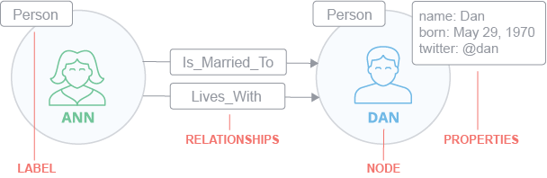

# 5 Graphenbasierte Datenbanken

## Graphdatenmodell

## Graphdatenbanken

### Orient DB

### Neo4j

#### Datenstruktur

Das "Labeled Property Graph Model" (Neo4j Inc., Product Basics) von Neo4j besteht aus Knoten (Node), Beschriftungen (Label), Beziehungen (Relationships) und Eigenschaften (Properties) (siehe Abbildung ?)

Die Knoten stellen die Hauptelemente dar. Wie hier im Beispiel "Ann" und "Dan". Sie sind untereinander durch Beziehungen verbunden. Zusätzlich können sie eine oder mehrere Eigenschaften besitzen. Entweder als einzelnes Attribut oder Key-Value-Paare. Außerdem besitzen Knoten Beschriftungen, um ihre Rolle im Graph zu beschreiben.

Beziehungen verbinden in der Regel zwei Knoten miteinander und sind direktional. Knoten können aber auch mehrere oder rekursive Beziehungen besitzen. Zusätzlich können Beziehungen auch mehrere Eigenschaften besitzen.

Eigenschaften werden als string abgebildet. Wenn sie einen Key besitzen, wird dieser auch als string gespeichert. Eigenschaften können sowohl über den Index als auch über den Key angesprochen werden. Kombinierte Indizes können von mehreren Eigenschaften geschaffen werden.

Durch Beschriftungen können Knoten in Gruppen eingeteilt werden. Ein Knoten kann dabei auch mehrere Beschriftungen besitzen. Beschriftungen sind dabei auch indexiert, um die Suche nach Knoten im Graph zu beschleunigen. Native Indizes sind im Hinblick auf Geschwindigkeit optimiert.

 

 
*Abbildung ?: Datenstruktur von Neo4j 
(https://s3.amazonaws.com/dev.assets.neo4j.com/wp-content/uploads/20170731095054/Property-Graph-Concepts-Simple.svg)*

#### Cypher

https://neo4j.com/cypher-graph-query-language/

#### Vorteile zu anderen NoSQL Datenbanken

https://neo4j.com/product/#comparison

### Arango DB

### Titan

## Algorithmen zur Abfrage

## Abfragesprachen

## Geschichte

